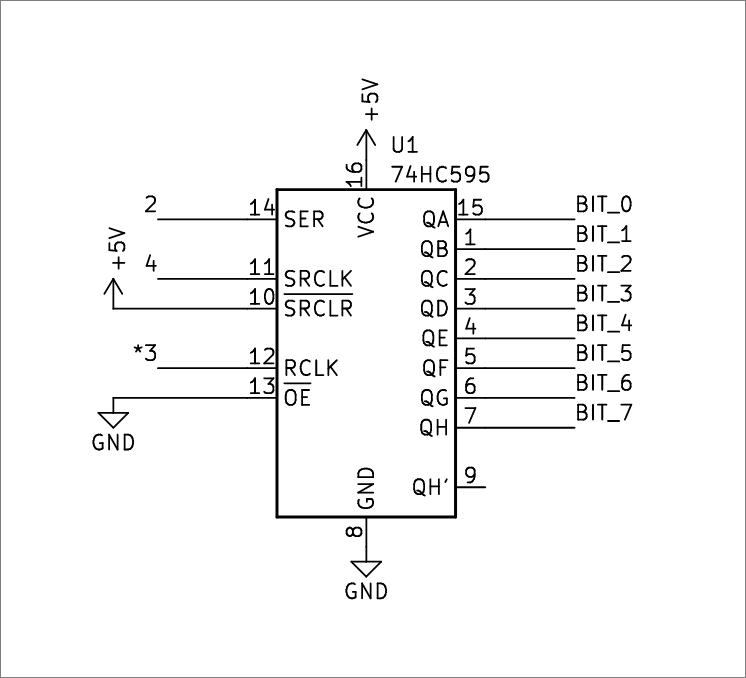
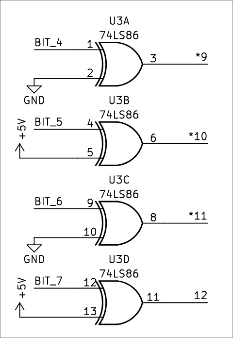
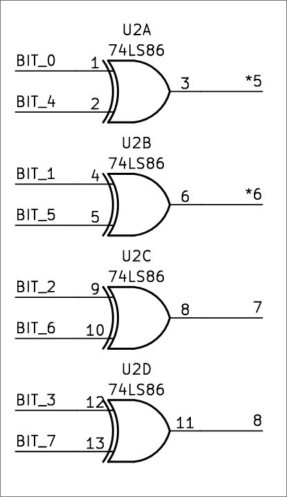

# harduino_encryption

> Recently my friend told me the reason people use hardware wallets is because hackers can't understand hardware, which makes them hack-proof.
> They made their own shield for the Arduino Uno and encrypted a message to prove it to me.
> Can you help me decrypt the message and prove them wrong?

Provided: [`harduino_encryption.zip`](harduino_encryption.zip)

## Solution

Being relatively unfamiliar with hardware (maybe this person's friend was right:)), I decided to look at the provided Arduino sketch first thing:

```c++
#define DATA 2
#define LATCH 3
#define CLOCK 4
#define BYTE_START 5

void setRegister(byte value) {
  digitalWrite(LATCH, LOW);
  shiftOut(DATA, CLOCK, MSBFIRST, value);
  digitalWrite(LATCH, HIGH);
}

byte getEncryptedChar() {
  byte output = 0;
  for (int i = BYTE_START; i < BYTE_START + 8; i++) {
    output |= digitalRead(i) << (i - BYTE_START);
  }
  return output;
}

void setup()
{
  pinMode(DATA, OUTPUT);
  pinMode(LATCH, OUTPUT);
  pinMode(CLOCK, OUTPUT);
  
  for (int i = BYTE_START; i < BYTE_START + 8; i++) {
    pinMode(i, INPUT);
  }
  
  Serial.begin(9600);
}

void loop()
{
  if (Serial.available() == 0) return;
  String input = Serial.readString();
  for (int i = 0; i < input.length(); i++) {
    setRegister(input[i]);
    Serial.print(getEncryptedChar(), HEX);
  }
  Serial.print('\n');
}
```

Nothing too complicated :)
From that we know a couple pin numbers and how they're used which we can cross-reference with the provided schematics.
It looks like each character of the input string is written to a shift register (based on the `shiftOut` function) and then read back out starting from pin 5 (`BYTE_START`).

In case you don't know what a shift register is, they essentially act like storage for small numbers of bits.
According to one of the provided datasheets:

> The SNx4HC595 devices contain an 8-bit, serial-in, parallel-out shift register that feeds an 8-bit D-type storage register.

So the shift register used for this challenge can store 8 bits.
The "serial-in, parallel-out" bit refers to how bits are read in and output from the register.
In this case, bits are written one by one (i.e. serially) to the shift register, "shifting" down until 8 bits are written (hence the name "shift register").
"Parallel-out," then, refers to all of the bits being readable at once.
In this case that's useful because it makes operations involving multiple bits easier, which brings us to the actual encryption process.

Taking a look back at the `setRegister()` function:

```cpp
void setRegister(byte value) {
  digitalWrite(LATCH, LOW);
  shiftOut(DATA, CLOCK, MSBFIRST, value);
  digitalWrite(LATCH, HIGH);
}
```

Based on the `MSBFIRST` argument, it looks like each character is fed into the shift register most significant bit first, so based on the shift register datasheet the `QH` output will be the highest bit, while `QA` will hold the lowest (least significant) bit.
This is nice since then each bit's significance sort of matches with their schematic numbering :)

<div align="center">

</div>

From there, the bits from the shift register are then fed into a few XOR gates.
Let's look at the four most significant bits first, since what's done to them is a bit simpler than the other four :)

<div align="center">

</div>

As you can see, each XOR gate takes in two inputs: one is just taken from the shift register, and the other is either tied to ground or 5V.
Because one input remains constant for each of this bits, it's easy to recover them.
Based on how the xor operation works, bits 4 and 6 will be unaffected by the XOR gate, while bits 5 and 7 will be flipped due to being xored with a high state.

Now for the four least significant bits:

<div align="center".

</div>

Instead of being xored with another constant input, the lower four bits are xored with the upper four bits.
Because we can trivially recover the upper four bits though, recovering this isn't too bad either; we just have to xor the lower four bits of each encrypted character with the recovered upper bits to reverse the "encryption process."

After all of that, the outputs from these XOR gates are just read back into a number, with the order of the bits being preserved:

```cpp
byte getEncryptedChar() {
  byte output = 0;
  for (int i = BYTE_START; i < BYTE_START + 8; i++) {
    // output is bitwise ored with each bit in the proper position
    output |= digitalRead(i) << (i - BYTE_START);
  }
  return output;
}
```

Based on all of that knowledge, we can then reverse the encryption process.
You could probably do it by hand but that's no fun so I ended up writing a Python program to do it for me :)

```python
if __name__ == "__main__":
    # encrypted hex data from provided zip
    data = bytes.fromhex("C9D4D2DCC592F7E7D29294FA92E9F5CA90E990C89497949293C8FA9296EA94FAC0D59090FA9690C5D2D59294FCDA")
    flag = ""

    for byte in data:
        # first and third most significant bits are flipped (BIT_5 and BIT_7 in schematic)
        byte ^= 0b10100000

        # least significant bits are xored with most significant bits
        byte ^= byte >> 4

        # convert codepoint back to character
        flag += chr(byte)

    print(flag)
```

Or, if you're more of a one-liner type of person:

```python
print("".join(chr(b ^ 0b10101010 ^ b >> 4) for b in bytes.fromhex("C9D4D2DCC592F7E7D29294FA92E9F5CA90E990C89497949293C8FA9296EA94FAC0D59090FA9690C5D2D59294FCDA")))
```

Running either of those should give you the flag :)

```shell
$ python decrypt.py
osu{c1RCu17_1MPl3M3n74710n_15N7_fr33_53cur17Y}

$ python -c 'print("".join(chr(b ^ 0b10101010 ^ b >> 4) for b in bytes.fromhex("C9D4D2DCC592F7E7D29294FA92E9F5CA90E990C89497949293C8FA9296EA94FAC0D59090FA9690C5D2D59294FCDA")))'
osu{c1RCu17_1MPl3M3n74710n_15N7_fr33_53cur17Y}
```

While things like [hardware security modules](https://en.wikipedia.org/wiki/Hardware_security_module) do definitely have their uses, there's more to their security than just their status as hardware :)
