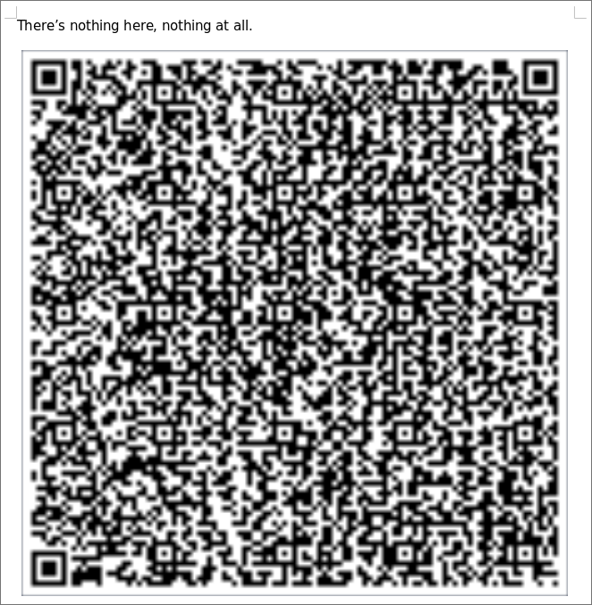

# intrainspection

> I've heard it's always important to have security on your files, and if it's worth doing once, it's worth doing a lot

## Solution

We're provided [a zip archive](intrainspection.zip), so a good thing to do right off the bat would probably be to extract it :)

```shell
$ unzip intrainspection.zip
Archive:  intrainspection.zip
 extracting: Safe.zip
   inflating: secure.py
```

So it has two files: another zip archive and a Python program.
That inner zip looks interesting, let's try extracting it as well:

```shell
$ unzip Safe.zip
Archive:  Safe.zip
[Safe.zip] jXeC.zip password:
```

Oh, that's a bit problematic - maybe [`secure.py`](extracted/secure.py) will have the password in it?

```python
import os
import random
import string

charset = string.ascii_letters
pw = (''.join(random.choices(charset, k=4)))
fn = (''.join(random.choices(charset, k=4)))
print(fn,pw)

os.system('zip '+fn+'.zip Nothing.docx -P '+pw)

for _ in range(30):
    fnOLD = fn
    pw = (''.join(random.choices(charset, k=4)))
    fn = (''.join(random.choices(charset, k=4)))
    print(fn,pw)
    os.system('zip '+fn+'.zip '+fnOLD+'.zip -mP '+pw)

fnOLD = fn
pw = (''.join(random.choices(charset, k=4)))
fn = "Safe"
print(fn,pw)
os.system('zip '+fn+'.zip '+fnOLD+'.zip -mP '+pw)
```

Hmmm...so we're not given the password directly but from that we do know that it's 4 characters long and consists of random ASCII letters based on the several `(''.join(random.choices(charset, k=4)))` calls.
Looks like there's 32 layers of zip encryption though...let's see, that's 52⁴ passwords per zip (4 chosen from 52 possibilities, with replacement) which turns out to be about 7 million?
So in the absolute worst case we'll have to try like 234 million passwords.
That doesn't sound very fun to do manually, but luckily there are tools that can do that sort of brute forcing for you :)
I ended up using [`fcrackzip`](http://oldhome.schmorp.de/marc/fcrackzip.html) since it's supposed to be fast or something (it's also what I found first haha).

I initially did all of the `fcrackzip` and `unzip` invocations by hand which was definitely not the best idea, so after the fact I wrote up [a quick Python script](bruteforce.py) to automate the process. After running it, you should get an output similar to this:

```shell
$ python bruteforce.py
Password for Safe.zip: bWVu
Password for jXeC.zip: dDBK
Password for dHag.zip: VzQX
Password for bSmC.zip: IcHj
Password for pbtJ.zip: CuTB
Password for VGQc.zip: BwWe
Password for jxLD.zip: MhqV
Password for iXZA.zip: EzAQ
Password for KxrU.zip: ScJZ
Password for DlTL.zip: zdXF
Password for PEOa.zip: wmeU
Password for Dggp.zip: KpKf
Password for tXFO.zip: ICBu
Password for IrHd.zip: GEeO
Password for wedJ.zip: rwGj
Password for wbTt.zip: vard
Password for TUuF.zip: uNtR
Password for tiTW.zip: dPKN
Password for dFhG.zip: DSLA
Password for fjIZ.zip: KGdA
Password for CMMw.zip: bQrZ
Password for MzNR.zip: YQND
Password for jLUX.zip: WBOZ
Password for XDDN.zip: PEEC
Password for vfyN.zip: qoxe
Password for uwPY.zip: NgHV
Password for xfQR.zip: fhkC
Password for DtQE.zip: teEk
Password for KWHz.zip: peRR
Password for EVqP.zip: wgcw
Password for DZen.zip: Alon
Password for Qymr.zip: rTPR
finished decrypting zips! took 16 minutes and 6 seconds
```

Yes it took 16 minutes and 6 seconds on my machine :)
After decrypting all 32 layers of zips, you should finally have the [Nothing.docx](extracted/Nothing.docx) file mentioned in secure.py above, which looks something like this when you open it up:

<div align="center">

</div>

The QR code contains a [Python script](extracted/qr-gen.py), but it appears to just generate a QR code from a given file (that's probably how the QR code itself was generated :)).

It was a bit unclear where to go from there, but then I remembered something: docx files are just fancy zip files, meaning that arbitrary files can be put inside them.
Given the 32 layers of zip files surrounding Nothing.docx, it would make sense if we had to keep peeling back layers :)
Let's extract it using unzip:

```shell
$ unzip Nothing.docx
Archive:  Nothing.docx
  inflating: BehindTheCurtain.xml
  inflating: docProps/app.xml
  inflating: docProps/core.xml
  inflating: word/document.xml
  inflating: word/endnotes.xml
  inflating: word/fontTable.xml
  inflating: word/footnotes.xml
 extracting: word/media/image1.png
  inflating: word/settings.xml
  inflating: word/styles.xml
  inflating: word/theme/theme1.xml
  inflating: word/webSettings.xml
  inflating: word/_rels/document.xml.rels
  inflating: [Content_Types].xml
  inflating: _rels/.rels
```

Most of those look like normal Word document stuff but [BehindTheCurtain.xml](./extracted/BehindTheCurtain.xml) looks interesting, maybe it'll have the flag?

```shell
$ head -1 BehindTheCurtain.xml
P!
  x[Content_Types].xml (j0EѶJ(ɢe4vDeIHw;$.M13ޣGMe0tJ2g%U8
(wΡum;!ο%>ZwB .hË9v6"sEWQQ_rrY2;ospn>8	1-U&;T*$Gĭow< ֹa  9BdhRۘ<T"f΃JB%^Cɽ~;q,k6=A!
                      _]:OHꭨ@?
                              P!N
                                _rels/.rels (j0
	^[x1xp                                 @ѽQN/[ILj<]aGӓzsFu]U
              f#I)ʃY*D
                      i")c$qU~31jH[{=E~
```

...yeah that doesn't look like XML. What does `file` say about it?

```shell
$ file BehindTheCurtain.xml
BehindTheCurtain.xml: Microsoft Word 2007+
```

Hmm...maybe we can open it up in ~~LibreOffice~~ Word again?

<div align="center">

</div>

Huh weird, I didn't know Word had it's own XML format.
Also did I mention this document has 300 pages?
There's no way I'm sifting through that manually :)

If this is a full-on Word file, maybe we can `unzip` it like we did with Nothing.docx?

```shell
$ unzip BehindTheCurtain.xml
Archive:  BehindTheCurtain.xml
  inflating: [Content_Types].xml
  inflating: _rels/.rels
  inflating: word/document.xml
  inflating: word/_rels/document.xml.rels
  inflating: word/footnotes.xml
  inflating: word/endnotes.xml
 extracting: word/media/image1.png
  inflating: word/theme/theme1.xml
  inflating: word/settings.xml
  inflating: word/styles.xml
  inflating: word/webSettings.xml
  inflating: word/fontTable.xml
  inflating: docProps/core.xml
  inflating: docProps/app.xml
```

It just keeps on going doesn't it :)
That image looks interesting though, it's probably on one of the 300 pages of BehindTheCurtain.xml.
Here it is (scaled up) for convenience:

<div align="center">

</div>

It turns out that for whatever reason you can only decode this QR code with [this website](https://online-barcode-reader.inliteresearch.com/default.aspx), but when you do you get a hexdump of what looks like an ELF binary:

```
0000  7f 45 4c 46 01 01 01 00  79 5f 66 69 67 30 30 33  | ~ELF~~~~y_fig003 |
0010  02 00 03 00 01 00 00 00  50 80 04 08 2c 00 00 00  | ~~~~~~~~P~~~,~~~ |
0020  00 00 00 00 00 00 00 00  34 00 20 00 01 00 00 00  | ~~~~~~~~4~ ~~~~~ |
0030  00 00 00 00 00 80 04 08  00 80 04 08 83 00 00 00  | ~~~~~~~~~~~~~~~~ |
0040  83 00 00 00 05 00 00 00  00 10 00 00 31 31 69 6e  | ~~~~~~~~~~~~11in |
0050  b8 04 00 00 00 31 db 43  ba 04 00 00 00 b9 7d 80  | ~~~~~1~C~~~~~~}~ |
0060  04 08 cd 80 83 e9 71 cd  80 29 d1 cd 80 83 c1 44  | ~~~~~~q~~)~~~~~D |
0070  cd 80 83 c1 35 4a 4a cd  80 48 4b cd 80 6f 73 75  | ~~~~5JJ~~HK~~osu |
0080  7b 7d 0a                                          | {}~              |
```

It looks like there's also fragments of the flag in a couple places, so if we run this binary we'll probably get the flag.
I just stuck that into [CyberChef](https://gchq.github.io/CyberChef/#recipe=From_Hexdump()&input=MDAwMCAgN2YgNDUgNGMgNDYgMDEgMDEgMDEgMDAgIDc5IDVmIDY2IDY5IDY3IDMwIDMwIDMzICB8IH5FTEZ%2Bfn5%2BeV9maWcwMDMgfAowMDEwICAwMiAwMCAwMyAwMCAwMSAwMCAwMCAwMCAgNTAgODAgMDQgMDggMmMgMDAgMDAgMDAgIHwgfn5%2Bfn5%2Bfn5Qfn5%2BLH5%2BfiB8CjAwMjAgIDAwIDAwIDAwIDAwIDAwIDAwIDAwIDAwICAzNCAwMCAyMCAwMCAwMSAwMCAwMCAwMCAgfCB%2Bfn5%2Bfn5%2BfjR%2BIH5%2Bfn5%2BIHwKMDAzMCAgMDAgMDAgMDAgMDAgMDAgODAgMDQgMDggIDAwIDgwIDA0IDA4IDgzIDAwIDAwIDAwICB8IH5%2Bfn5%2Bfn5%2Bfn5%2Bfn5%2Bfn4gfAowMDQwICA4MyAwMCAwMCAwMCAwNSAwMCAwMCAwMCAgMDAgMTAgMDAgMDAgMzEgMzEgNjkgNmUgIHwgfn5%2Bfn5%2Bfn5%2Bfn5%2BMTFpbiB8CjAwNTAgIGI4IDA0IDAwIDAwIDAwIDMxIGRiIDQzICBiYSAwNCAwMCAwMCAwMCBiOSA3ZCA4MCAgfCB%2Bfn5%2BfjF%2BQ35%2Bfn5%2Bfn1%2BIHwKMDA2MCAgMDQgMDggY2QgODAgODMgZTkgNzEgY2QgIDgwIDI5IGQxIGNkIDgwIDgzIGMxIDQ0ICB8IH5%2Bfn5%2BfnF%2Bfil%2Bfn5%2BfkQgfAowMDcwICBjZCA4MCA4MyBjMSAzNSA0YSA0YSBjZCAgODAgNDggNGIgY2QgODAgNmYgNzMgNzUgIHwgfn5%2BfjVKSn5%2BSEt%2Bfm9zdSB8CjAwODAgIDdiIDdkIDBhICAgICAgICAgICAgICAgICAgICAgICAgICAgICAgICAgICAgICAgICAgfCB7fX4gICAgICAgICAgICAgIHwK) and saved it to obtain [the actual binary](extracted/qr-elf).
From there, we can finally run it and get the flag:

```shell
$ ./qr-elf
osu{g003y_fi11in}
```

Like all CTF challenges it was satisfying to finally get the flag but *oh man* that was obnoxious haha.
Misc challenges amirite :)