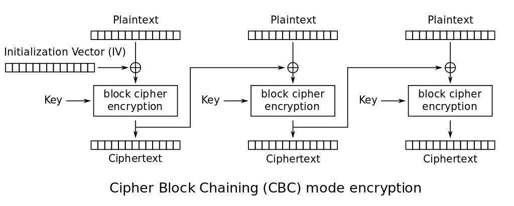

# SimpleOracle

> You have intercepted an encrypted message that was on its way to a server.
> Can you use the weakness of encryption scheme to recover the original message?

Provided: [`simple_oracle.tar.gz`](simple_oracle.tar.gz)

## Solution

As it turns out, we can in fact use the weakness of the encryption scheme to recover the original message :)
The specific attack you need to do is called a [padding oracle attack](https://en.wikipedia.org/wiki/Padding_oracle_attack), which I'll to my best to explain in this writeup.
Before I do that, though, let's go over a little bit of background on AES and how it's used.

### AES, CBC, and other TLAs (three-letter acronyms)

(Note: feel free to skip this section if you see something like AES-128-CBC and know what that means :))

AES (the Advanced Encryption Standard) is basically The Symmetric Encryption Algorithm™ in use today.
In case you don't know, symmetric encryption algorithms use the same key to encrypt and decrypt messages.
That's as opposed to an asymmetric (or public-key) algorithm like RSA, where different keys are used to encrypt and decrypt a message.
It's also what's called a **block cipher**, which basically means it chunks up a message into blocks of a specific size and encrypts them that way.
Again, the main (only?) other type of cipher is a stream cipher, which generates a keystream that is xored with the message to encrypt it.

While you could just directly encrypt a message/file/whatever with AES (what's referred to as using it electronic codebook (ECB) mode), that's generally a bad idea since it reveals patterns in the underlying "plaintext."
As such, people have come up with lots of ways to use AES (and other block ciphers), which is where all of the three letter acronyms come in.
You can read more about them on [Wikipedia](https://en.wikipedia.org/wiki/Block_cipher_mode_of_operation) if you'd like, but here are a couple other examples:

- Cipher block chaining (CBC) - xors each plaintext block with the previous ciphertext block before encrypting
- Counter mode (CTR) - transforms AES into a stream cipher; keystream is generated by encrypting successive "counter" blocks
- Galois counter mode (GCM) - basically CTR mode extended with some Funky Math™ to bake in authentication

CBC is the mode used in this challenge, and as such you should probably be able to assume that it's generally recommended not to use it nowadays :)
Here's a picture illustrating the process of CBC encryption if that's helpful:

<div align="center">

</div>

Each block of ciphertext is basically treated as the initialization vector (IV) for the next block of plaintext, hence the "chaining" part of cipher block chaining.
CBC is better than the ECB encryption that I mentioned earlier in that patterns in the plaintext don't carry over to the ciphertext, but it doesn't come without its own problems.
The most glaring one is a lack of authentication, which allows someone to tamper with a ciphertext/IV combo to reveal information about the plaintext (like we do for this challenge).
GCM mode specifically is nice in that regard since you get authentication for free, but there are other MAC (message authentication code) algorithms that you can use like HMAC or Poly1305 (if you're using the ChaCha20 cipher which is not something I'm going to talk about since I'm already off topic lol).
Aside from that, another property CBC has is that if you flip a single bit in a block, it only affects the decryption of that block and the next one; none of the other blocks are affected.
This again allows you to tamper with a ciphertext and glean information about it if you have a server that's willing to decrypt whatever you send it.
Modes like CTR, GCM and even PCBC (propagated cipher block chaining) address this through various means, but for the purposes of this challenge we do kinda need that property :)

Anyways enough about acronyms, I'm not good at segues so let's talk about padding now :)

### Padding (the contents of my writeup)

I mentioned earlier that AES is a block cipher (when used in CBC mode at least), which means that a given plaintext has to be split into chunks before encrypting it.
A sort of side effect of this is that the plaintext has to be long enough that it splits evenly into blocks of the correct size, which turns out to be 16 bytes for AES.
Obviously not everything is a multiple of 16 bytes long, so a while ago people devised schemes to pad messages so that block ciphers could actually be usable.
The relevant padding scheme for this challenge is called PKCS#7.

To quote [Wikipedia](https://en.wikipedia.org/wiki/Padding_(cryptography)#PKCS#5_and_PKCS#7) on how it works:

> Padding is in whole bytes. The value of each added byte is the number of bytes that are added, i.e. N bytes, each of value N are added. The number of bytes added will depend on the block boundary to which the message needs to be extended. 
>
> The padding will be one of: 
>
> ```
> 01
> 02 02
> 03 03 03
> 04 04 04 04
> 05 05 05 05 05
> 06 06 06 06 06 06
> etc.
> ```
>
> ...
>
> Example: In the following example, the block size is 8 bytes and padding is required for 4 bytes
>
> ```
> ... | DD DD DD DD DD DD DD DD | DD DD DD DD 04 04 04 04 |
> ```

Hopefully that makes sense :)

All that matters for our purposes is that it's deterministic, and we can take advantage of exactly how it works to gradually decipher a given ciphertext.
In order to do that though, we need what's called a **padding oracle** (hence the name "padding oracle attack" that I mentioned a while ago :)).
A padding oracle takes arbitrary IV/ciphertext pairs and responds with whether the decrypted ciphertext has valid padding or not.
That may not seem very useful, but as it turns out it's still enough information to recover an encrypted message.
To understand why, we'll have to delve a bit more into how CBC mode works.

### Using a padding oracle: or, how to get the flag

Consider a random message that's longer than 16 bytes that's encrypted using AES in CBC mode.
It will end up being split into at least two blocks, the last of which will contain padding.
Obviously any block other than the last one won't have valid PKCS7 padding as-is, but what if you could modify what each block decrypts to somehow?
Well as it turns out you can do exactly that by tampering with the encryption IV for a specific block.
Because decryption involves decrypting a given block and xoring it with the IV, modifying the IV also changes the effective "plaintext" a given ciphertext block decrypts to.
If you can modify the IV such that a given (non-padded) block suddenly has valid padding, you gain some useful information about the plaintext.

Ignoring the IV for a second, a given ciphertext block directly decrypts to $IV \oplus pt_1$, where $pt_1$ represents the first block of plaintext.
Normally that then gets xored with the IV, leaving you with just $pt_1$.
However, if you change the last byte of the IV, the last byte of the plaintext will instead be $IV_{16} \oplus pt_{1,16} \oplus IV'_{16}$ (I use subscripts here to represent byte positions).
If you do that and a padding oracle tells you the plaintext has valid padding under PKCS7, you gain some really useful information, namely that $IV_{16} \oplus pt_{1,16} \oplus IV'_{16} = 0x01$ (since the plaintext has one byte of padding).
Because $IV_{16}$ and $IV'_{16}$ are known, this equation can be rearranged to solve for the last byte of the plaintext, yielding $pt_{1,16} = 0x01 \oplus IV_{16} \oplus IV'_{16}$

Once you recover the last byte, you can then use a similar process for each successive byte in reverse, going through all possible values for the corresponding byte of the IV until the server tells you the ciphertext you send in has valid padding.
The padding byte will change with the amount of effective padding because of how PKCS7 works (0x02 for 2 bytes, 0x03 for 3 bytes, etc.) but the above equation still holds otherwise.
The IV does have to be slightly modified for this to work beyond just changing the one byte, though; every byte after the one being tested has to be correct for the padding to be considered correct as well.
This can be accomplished by xoring each byte of the IV $IV_i$ corresponding to each following plaintext byte with $pt_i \oplus pad$, where $pad$ is the desired padding byte.

Once a full block is recovered, you can then use the same process for the next block of ciphertext, swapping out the IV for the preceding block of ciphertext (i.e. the one that was just decoded).

I know that was a lot of information so hopefully at least some of it made sense :)
If it would help, a professor at OSU made a sort of interactive demo of padding oracle attacks which you can find [here](https://web.engr.oregonstate.edu/~rosulekm/crypto/padding.html).

With all of that in hand though, we can finally recover the flag!

### The fun part :)

I mean there's not much to say here without me repeating stuff I said earlier :)

You can check out [my solve script](./simply_decrypt.py) if you'd like, and as always it gives us the correct flag:

```shell
$ python simply_decrypt.py
success! cand = 124
success! cand = 73
success! cand = 55
# --snip--
success! cand = 30
success! cand = 31
success! cand = 0
flag: osu{C8c_15_w34K}
```

And there's our flag!
I wouldn't necessarily call CBC weak per se but using it without any form of authentication is just asking for trouble :)
