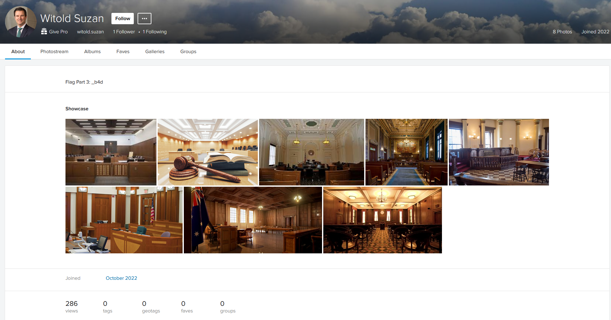

# Slippin' Witty

## Challenge description

> You’re a detective working in the DoJ tasked with investigating a lawyer by the name of Witold Suzan for possible corruption. You’ve been informed by one of his coworkers that he uses four different social media platforms online. Find all four accounts owned by him.

## Solution

### Initial research

A good place to start when looking for information is good old Google:

Aha! Opening up that LinkedIn profile confirms that this is indeed our man:

  

Now we have the second part of the flag, probably out of 4 since that's the number of accounts that we were given.

That resume looks interesting, let's check it out:

An email, huh? Luckily tools like [holehe](https://github.com/megadose/holehe) exist to check if an email is associated with accounts on a bunch of different accounts at once. Running `witold.suzan@gmail.com` through holehe yields the following results:

Looks like Flickr and Twitter were the only two matches, so the third account will probably be tougher to find. Just looking up "Witold Suzan" on both of these platforms yields results pretty quickly though:

So now we know the first 3/4 of the flag: `osu{k1d_nam3d_b4d`. Now we have to look for the last account :)

### The Final Account

So there aren't any more results that are immediately obvious while searching Google, so we'll have to look through the other accounts for clues as to what the fourth account is. The LinkedIn really only has the resume, and the Flickr is just a bunch of stock photos. The Twitter is interesting though: it has a screenshot of Suzan's screen after he made his LinkedIn:

Have you noticed it yet? And no, I'm not referring to him googling "raccoon" :) The second tab he has open is Reddit with an account starting with `Ancient`! I tried looking for a user with the username `AncientFan31` like his Twitter, but wasn't able to find anything. Apparently the intended way to find it was to keyword search on Reddit by checking out [his Twitter in the Wayback Machine](https://web.archive.org/web/20221012024752/https://twitter.com/AncientFan31), but after some epic Googling you'll get him at some point in the first few results:

  
  

And that gives us the final part of our flag! The full flag is `osu{k1d_nam3d_b4d_0psEC}`, which I assume is a Breaking Bad reference or something (idk I haven't seen Breaking Bad :)). If you ever decide to become a corrupt lawyer (please don't), at least make sure not to post about your bribes on accounts easily traced back to you ;)
