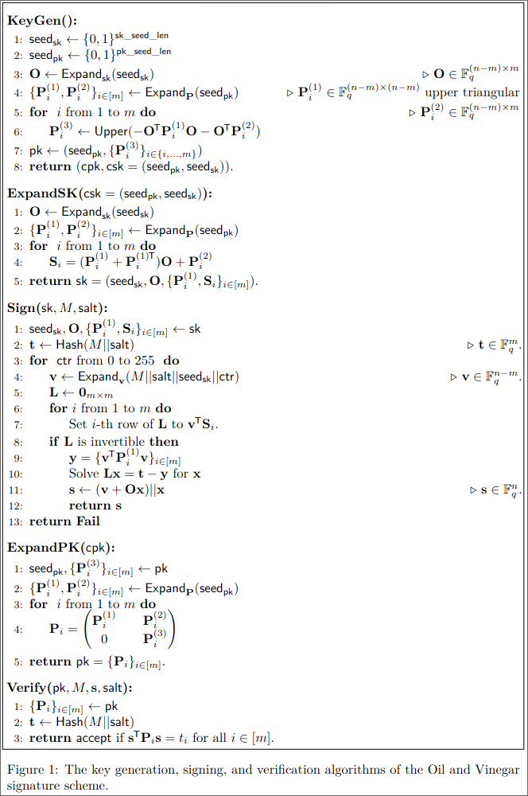

# crypto/vinaigrette (4 solves / 436 points*)

> Welcome to Dice Bistro, where every bite is an adventure in flavor. Our secret vinaigrette recipe is closely guarded, ensuring that its tantalizing taste remains a mystery to all but the most skilled cryptographers.

*(solved after CTF ended)

Downloads:
- [vinaigrette.py](./provided/vinaigrette.py)
- [pk.bin](./provided/pk.bin)
- [pqov-paper.tar.gz](./provided/prov-paper.tar.gz)
- [patch.diff](./provided/patch.diff)

## First Look

Let's take a look at where our input is processed in vinaigrette.py:

```python
if __name__ == "__main__":
    # --snip--
    order = input('What would you like to order? ').encode()
    if order == b'the vinaigrette recipe':
        print('Only employees of Dice Bistro are allowed to learn the vinaigrette recipe.')
        try:
            sm = bytes.fromhex(input('Authorization: '))
            assert verify(pk, sm) == order
            print(f'Certainly, here it is: {flag}')
        except:
            print('error')
    else:
        sm = sign(sk, order)
        print(f'Certainly, here it is: {sm.hex()}')
```

So it looks like we can sign any message other than "the vinaigrette recipe" using the server's secret key, but we'll ultimately need to somehow sign "the vinaigrette recipe" through other means in order to get the flag.
Surely this will be interesting :)

## Solution

Based on the README from the extracted tarball, this challenge is based on the paper ["Oil and Vinegar: Modern Parameters and Implementations"](https://eprint.iacr.org/2023/059).
I don't fully understand oil and vinegar schemes, but the pseudocode for the signing/verification process provided by the paper was useful:

<div align="center">

</div>

Obviously if you're curious you can read the paper to learn more about oil and vinegar schemes, I just lack most of the math background :)

Along with the code written by the paper authors, we're also provided a patch file, so let's check that out:

```diff
diff --git a/Makefile b/Makefile
index a30364c..925a568 100644
--- a/Makefile
+++ b/Makefile
@@ -17,7 +17,7 @@ SRC_DIR  = ./src
 UTIL_DIR = ./utils


-CFLAGS   := -O3 $(CFLAGS) -std=c11 -Wall -Wextra -Wpedantic -Werror -fno-omit-frame-pointer #-pg -g -fsanitize=address
+CFLAGS   := -O3 $(CFLAGS) -std=c11 -Wall -Wextra -Wpedantic -Werror -fno-omit-frame-pointer -fPIC #-pg -g -fsanitize=address
 CXXFLAGS := -O3 $(CPPFLAGS) -Wall -Wextra -fno-exceptions -fno-rtti -nostdinc++
 INCPATH  := -I/usr/local/include -I/opt/local/include -I/usr/include -I$(SRC_DIR) -I$(UTIL_DIR)
 LDFLAGS  := $(LDFLAGS) #-fsanitize=address
@@ -189,6 +189,10 @@ endif
 all: $(EXE)


+libpqov.so: $(OBJ)
+	$(CC) -shared $(CFLAGS) $(INCPATH) -o $@ $^ $(LIBS)
+
+
 neon-matxvec-test: $(OBJ) neon-matxvec-test.o
 	$(LD) $(LDFLAGS) $(LIBPATH) -o $@ $^ $(LIBS)

diff --git a/src/ov.c b/src/ov.c
index b62f3ca..0fd7e7f 100644
--- a/src/ov.c
+++ b/src/ov.c
@@ -52,8 +52,8 @@ int ov_sign( uint8_t * signature , const sk_t * sk , const uint8_t * message , u
     // The computation:  H(M||salt)  -->   y  --C-map-->   x   --T-->   w
     hash_init  (&h_m_salt_secret);
     hash_update(&h_m_salt_secret, message, mlen);
-    hash_update(&h_m_salt_secret, salt, _SALT_BYTE);
     hash_ctx_copy(&h_vinegar_copy, &h_m_salt_secret);
+    hash_update(&h_m_salt_secret, salt, _SALT_BYTE);
     hash_final_digest( y , _PUB_M_BYTE , &h_m_salt_secret);  // H(M||salt)

     hash_update(&h_vinegar_copy, sk->sk_seed, LEN_SKSEED );   // H(M||salt||sk_seed ...
```

It looks like the patch adds the ability to build the paper's code as a shared library, but it also swaps two lines in the `ov_sign` function which looks interesting.
Based on that, it looks like this patched version doesn't include the salt when it generates the vinegar since the `h_m_salt_secret` hash context is copied into `h_vinegar_copy` before that.
This means that instead of the vinegar being

$$\text{Expand}_v(M||\text{salt}||\text{seed}_\text{sk}||\text{ctr})$$

it will instead be

$$\text{Expand}_v(M||\text{seed}_\text{sk}||\text{ctr})$$

which means that the same message will also have the same vinegar vector (assuming the counter remains at zero which appears to be the case for a large majority of cases).
While the generation of the target vector $t$ does still involve the salt, this only means that the $x$ vector will differ between signatures of the same message.
This gives us a nice property when subtracting different signature vectors from signing the same message:

```math
(\mathbf{v} + O\mathbf{x}_1) - \mathbf{v} + O\mathbf{x}_2) = O\mathbf{x}_1 - O\mathbf{x}_2 = O(\mathbf{x}_1 - \mathbf{x}_2)
```

Because a message's signature also includes the corresponding $\mathbf{x}$ vector based on the above figure, we can then calculate $\mathbf{x_1} - \mathbf{x_2}$ separately, allowing us to set up a system of linear equations to solve for the matrix $O$.
We have to sign several of these message pairs, though, in order to be able to actually solve the system of equations.
To figure out how many, we need to take a bit of a closer look at the provided source code tarball :)

### Parameters

At the top of [vinaigrette.py](./provided/vinaigrette.py), we're given a command to build the `libpqov.so` that was presumably used on the server:

```python
# tar -xf pqov-paper.tar.gz && patch -p1 < patch.diff && make libpqov.so VARIANT=2
```

The VARIANT flag looks interesting, and based on the README provided in the tarball `VARIANT=2` enables code delineated iwth the `_OV_PKC` macro. The actual paper goes into detail as to what this means:

> `pkc:` In this pk-compressed variant, ExpandSK is considered part of the KeyGen algorithm, but ExpandPK is considered part of the verification algorithm. This makes the public key much smaller (by a factor between 6 and 7), but makes verification slower.

So it looks like the public key we were provided is compressed, so its structure looks like this based on `src/ov_keypair.h` from the tarball:

```c
/// @brief compressed public key
///
///  compressed public key
///
typedef
struct {
    unsigned char pk_seed[LEN_PKSEED];                      ///< seed for generating l1_Q1,l1_Q2
    unsigned char P3[_PK_P3_BYTE];
} cpk_t;
```

So that means that we have the public key seed as well as its $P^{(3)}_i$ matrices.

The README also mentions different OV parameters that affect the number of vinegar and oil variables. Because the `PARAM=` flag isn't specified in the above command, it defaults to the following set of parameters (from `src/params.h`):

```c
#elif defined _OV256_112_44
#define _GFSIZE 256
#define _PUB_N 112
#define _PUB_M 44
#define _HASH_LEN 32
```

Later on in that file the number of oil and vinegar variables are also declared as macros:

```c
#define _O (_PUB_M)
#define _V ((_PUB_N)-(_O))

// ...

// GF256
#define _V_BYTE (_V)
#define _O_BYTE (_O)
#define _PUB_N_BYTE  (_PUB_N)
#define _PUB_M_BYTE  (_PUB_M)
```

Based on all of that, it looks like there are 44 oil variables and 112-44=68 vinegar variables.
This means that in order to solve for the $O$ matrix, we'll need to sign the same message 44 times in order for the linear system we set up to be solvable.
With that knowledge in hand, let's get to it :)

### Recovering $O$

Initially I tried to get this set up with [sagemath](https://www.sagemath.org/), but I couldn't figure out why casting any number to `GF(256)` would only be 0 or 1.
I saw that the author of the challenge used [`numpy`](https://numpy.org/) with the [`galois`](https://github.com/mhostetter/galois) library, so I figured I'd try that instead and it seemed to work well :)

Before we recover $O$, though, we do need to figure out the structure of the signature we receive.
This is the last chunk of the `ov_sign` function in `src/ov.c` that's used to sign messages:

```c
int ov_sign( uint8_t * signature , const sk_t * sk , const uint8_t * message , unsigned mlen )
{
    // lots of snip

    //  w = T^-1 * x
    uint8_t * w = signature;   // [_PUB_N_BYTE];
    // identity part of T.
    memcpy( w , vinegar , _V_BYTE );
    memcpy( w + _V_BYTE , x_o1 , _O_BYTE );

    // Computing the t1 part.
    gfmat_prod(y, sk->t1, _V_BYTE , _O , x_o1 );
    gf256v_add(w, y, _V_BYTE );

    // return: signature <- w || salt.
    memcpy( signature + _PUB_N_BYTE , salt , _SALT_BYTE );

    return 0;
}
```

Based on crossreferencing that with the figure from above, it looks like the response we're provided from the server has the structure

```math
(\mathbf{v} + O\mathbf{x}) || \mathbf{x} || \text{salt}
```

but that's not quite correct. The `ov_sign` function is called from the `crypto_sign` function, and it's the latter that's called directly from vinaigrette.py.
Let's check it out as well (this time it's located in `src/sign.c`):

```c
int
#if defined(PQM4)
crypto_sign(unsigned char *sm, size_t *smlen, const unsigned char *m, size_t mlen, const unsigned char *sk)
#else
crypto_sign(unsigned char *sm, unsigned long long *smlen, const unsigned char *m, unsigned long long mlen, const unsigned char *sk)
#endif
{
	int r = -1;
#if defined _OV_CLASSIC

	r = ov_sign( sm + mlen , (const sk_t*)sk , m , mlen );

#elif defined _OV_PKC

	r = ov_sign( sm + mlen , (const sk_t*)sk , m , mlen ); // <---- this is the sign function that's called

#elif defined _OV_PKC_SKC

	r = ov_expand_and_sign( sm + mlen , (const csk_t*)sk , m , mlen );

#else
error here
#endif
	memcpy( sm , m , mlen ); // <---- this is where the message is copied to the result buffer
	smlen[0] = mlen + OV_SIGNATUREBYTES;

	return r;
}
```

This means that the actual structure of the message is

```math
M || (\mathbf{v} + O\mathbf{x}) || \mathbf{x} || \text{salt}.
```

We only care about the second and third chunks for setting up the system of equations to solve.
From earlier, we know that $(\mathbf{v} + O\mathbf{x})$ is 68 bytes long and \mathbf{x} is 44 bytes long, so we can slice the hex string we get accordingly.
We also have to turn those byte slices into vectors over GF(256) like the C library does, but that's not too hard because of the `galois` library.

Once we get the $O$ matrix, though, we still have to convert it into a format usable by the C library we're provided, which takes a bit more work.

### Making $O$ usable

Let's take a look back at the pseudocode from the paper, specifically the ExpandSK function:

<div align="center">

</div>

Normally, the secret key can be derived from only the seeds of the public and private keys.
However, since we have the $O$ matrix, it turns out that we don't actually need the secret key seed in order to get a functional secret key.
Technically the secret key seed is used during the signing process, but it turns out that you don't actually need it to forge a signature since it's only used during the vinegar generation, which is random(ish) anyways because of the salt.

As for the public key seed, if you recall I mentioned a while back that the public key we're provided is compressed, meaning that it contains the public key seed.
This means that if we patch the `expand_sk` function in `src/ov_keypair.c` to accept the $O$ matrix instead of the secret key seed, we'll be able to create a key that will be usable to sign arbitrary messages!

Here's the patch that I ended up using to facilitate this, which you can also find in [its own file](t1-sk-expand.diff):

```diff
diff --git a/src/ov_keypair.c b/src/ov_keypair.c
index 7269725..ca12b70 100644
--- a/src/ov_keypair.c
+++ b/src/ov_keypair.c
@@ -144,6 +144,30 @@ int expand_sk( sk_t* sk, const unsigned char *pk_seed , const unsigned char *sk_
     return 0;
 }

+int expand_sk_from_t1( sk_t* sk, const unsigned char *pk_seed , const unsigned char *t1 )
+{
+    memcpy( sk->pk_seed , pk_seed , LEN_PKSEED );
+
+    // copy t1 into sk
+    memcpy( sk->t1 , t1, sizeof(sk->t1) );
+
+    // prng for pk
+    prng_publicinputs_t prng1;
+    prng_set_publicinputs(&prng1 , pk_seed );
+    // P1
+    prng_gen_publicinputs(&prng1, sk->P1 , sizeof(sk->P1) );
+    // P2
+    prng_gen_publicinputs(&prng1, sk->L , sizeof(sk->L) );
+
+    // calcuate the parts of sk according to pk.
+#if defined(_BLAS_M4F_)
+    ov_pkc_calculate_F_from_Q( sk );
+#else
+    calculate_F2( sk->L , sk->P1 , sk->L , sk->t1 );
+#endif
+    return 0;
+}
+


 ////////////////////////////////////////////////////////////////////////////////////
```

This function is basically just `expand_sk` with the beginning changed to just directly copy `t1` (what the researchers call $O$ in the library code for some reason??) into the expanded secret key.

From there, we finally have all the ingredients we need to obtain the vinaigrette recipe :)

### Signature forging

Before passing the $O$ matrix to the `expand_sk_from_t1` function created in the diff above, it does have to be converted to a format that C recognizes.
It turns out that numpy has the [`ndarray.tobytes`](https://numpy.org/doc/stable/reference/generated/numpy.ndarray.tobytes.html) function which does exactly that which is really convenient :)

After patching and rebuilding `libpqov.so`, we can then use it from Python via the [`ctypes`](https://docs.python.org/3.10/library/ctypes.html) module, something which was very nicely demonstrated in vinaigrette.py as provided.

I ended up copying over the signing function from vinaigrette.py, and my secret key forging function looked like this:

```python
def forge_sk(pk_seed, t1):
    sk = ctypes.create_string_buffer(CRYPTO_SECRETKEYBYTES)
    assert libpqov.expand_sk_from_t1(sk, pk_seed, t1) == 0
    return sk
```

With that in hand, we can finally obtain the secret vinaigrette recipe!

```shell
$ python pwn_salad.py
# --snip--
signing message 42/44
signing message 43/44
signing message 44/44
Certainly, here it is: dice{m1x_M_v4rs_0f_o1L_and_N-M_var5_of_v1n3gar}
```

Neat! Even though I didn't get this challenge during the CTF proper, it was still really cool learning about oil and vinegar cryptosystems, even if the C implementation was painful to read :)
