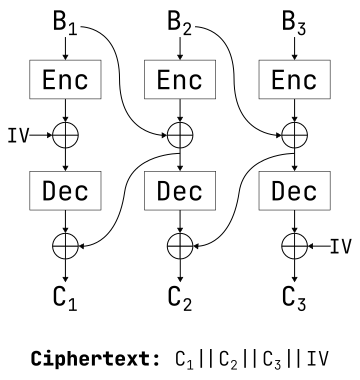

# Crypto/Cleithrophobia (58 solves / 472 points)

> To protect my flag from you I both encrypted AND decrypted it with AES, but differently. Does that make sense? I'm kind of confused myself honestly...
>
> NOTE: the flag you will receive is in the format of `flag{...}`. Manually change this to `idek{...}` when submitting

Provided files: [cleithrophobia.tar](./cleithrophobia.tar)
Solve script: [pwn_onion.py](./pwn_onion.py)

## Solution

I know it's not related to the challenge, but can we just take a second to acknowledge that splash screen?

```
|
|
|       __ _       ___ ____ ______ __ __ ____   ___  ____  __ __  ___  ____  ____  ____
|      /  ] |     /  _]    |      |  |  |    \ /   \|    \|  |  |/   \|    \|    |/    |
|     /  /| |    /  [_ |  ||      |  |  |  D  )     |  o  )  |  |     |  o  )|  ||  o  |
|    /  / | |___/    _]|  ||_|  |_|  _  |    /|  O  |   _/|  _  |  O  |     ||  ||     |
|   /   \_|     |   [_ |  |  |  | |  |  |    \|     |  |  |  |  |     |  O  ||  ||  _  |
|   \     |     |     ||  |  |  | |  |  |  .  \     |  |  |  |  |     |     ||  ||  |  |
|    \____|_____|_____|____| |__| |__|__|__|\_|\___/|__|  |__|__|\___/|_____|____|__|__|
|
|
|  ~ I trapped the flag using AES encryption and decryption layers, so good luck ~ ^w^
|
|    flag = 5071da0e9c54a90ddc9a2c60beaa2bdf317df2566280150e674f7f7e5d6fa7d6
|
|  ~ Want to encrypt something?
|
|    > (hex) 
```

That's some ascii art right there :) Anyways, on to the task at hand.

As the prompt implies, our input has to be valid hex:

```python
# Server loop
while True:

    try:

        print("|\n|  ~ Want to encrypt something?")
        msg = bytes.fromhex(input("|\n|    > (hex) "))

        enc = encrypt(msg, KEY)
        print(f"|\n|   {enc.hex()}")
    # --snip--
```

We also get our encrypted input back in hex, so we'll have to keep that in mind.

Let's take a look at that `encrypt` function since we will have to manipulate it to decrypt the flag :)

```python
# Server encryption function
def encrypt(msg, key):

    pad_msg = pad(msg, 16)
    blocks = [os.urandom(16)] + [pad_msg[i:i+16] for i in range(0,len(pad_msg),16)]

    itm = [blocks[0]]
    for i in range(len(blocks) - 1):
        tmp = AES.new(key, AES.MODE_ECB).encrypt(blocks[i+1])
        itm += [bytes(j^k for j,k in zip(tmp, blocks[i]))]

    cip = [blocks[0]]
    for i in range(len(blocks) - 1):
        tmp = AES.new(key, AES.MODE_ECB).decrypt(itm[-(i+1)])
        cip += [bytes(j^k for j,k in zip(tmp, itm[-i]))]

    return b"".join(cip[::-1])
```

That's a lot to unpack haha :) It seems to start off by padding the message to a 16 byte block size.
16 random bytes are generated and basically treated as an initialization vector (IV), and the message is then broken up into 16-byte blocks which AES requires.
From there, each plaintext block (including the IV, not including the last block) is xored with the...next block encrypted with plain AES?
Then those resulting block are iterated over *backwards* with each one being decrypted, again with plain AES, and xored with the next block?
(wrapping around to the beginning of the list, of course)
After all of that, the blocks are rejoined in reverse order so the ciphertext blocks are roughly in the order of the original message (if that even exists :)) with the IV at the end.

That's a lot of text so I figured a diagram might help explain what's happening better:

<div align="center">

</div>

(Note: I used `Enc` and `Dec` represent AES-ECB encryption and decryption, respectively. `||` represents concatenation of blocks.)

As an aside, because there's several layers of encryption and decryption, I decided to term this encryption scheme AES-ONION, which stands for Obtuse & Needlessly Inefficient Obfuscation Network :)
It's obviously designed to be confusing (i.e. obtuse), and it's (probably) inefficient since the entire message effectively has to be iterated over twice due to the two steps of encryption :).

Anyways, we can then derive expressions for each ciphertext block based on the above diagram:

$$C_1 = \text{Dec}(IV \oplus \text{Enc}(B_1)) \oplus B_1 \oplus \text{Enc}(B_2)$$

$$C_2 = \text{Dec}(B_1 \oplus \text{Enc}(B_2)) \oplus B_2 \oplus \text{Enc}(B_3)$$

$$C_3 = \text{Dec}(B_2 \oplus \text{Enc}(B_3)) \oplus IV$$

So how are those equations useful?
Well, we know the IV, so we can compute $C_3 \oplus IV = \text{Dec}(B_2 \oplus \text{Enc}(B_3))$.
If we have a method to encrypt single blocks, encrypting that will give us 
$D_3 = \text{Enc}(\text{Dec}(B_2 \oplus \text{Enc}(B_3)) = B_2 \oplus \text{Enc}(B_3)$, which you might notice is also the last half of $C_2$.
We can then utilize a similar process of xoring and encryption for both $C_2$ and $C_1$ which allows us to recover the value $IV \oplus \text{Enc}(B_1)$.
We again know the IV, so we can recover $\text{Enc}(B_1)$ by computing $IV \oplus (IV \oplus \text{Enc}(B_1))$.
Using a method to decrypt single blocks we can recover $B_1$, which then allows us to recover $B_2$ from the expression $D_2 = B_1 \oplus \text{Enc}(B_2)$; $B_3$ can be recovered as well via a similar process.

It's great that decrypting a ciphertext is possible, but that's predicated on being able to decrypt and encrypt individual blocks.
Unfortunately we're only able to get the server to encrypt full messages as shown in the above diagram, so we'll have to be a bit more clever to be able to act on individual blocks.

## Reinventing encryption

It should be pretty obvious that in order to encrypt a single block, it's going to have to somehow bypass the decryption step of this encryption scheme.
Really the only way to do that is via the final xor step, which requires us to somehow cancel both the previous plaintext block and the decrypt/xor/encrypt output of that block as well.
If we set the previous block of plaintext to be a bunch of zeros, though, we no longer have to cancel it, since anything xor a bitstring of zeros is just itself.
If only we could just directly decrypt the encrypted null block without having to worry about the xor before decryption :)
Luckily that happens if we prepend another null block to our plaintext! If we focus on the equation for $C_2$ from above (using $0$ to represent a null block and $B$ the block to be encrypted):

```math
\begin{align*}
C_2 &= \text{Dec}(0 \oplus \text{Enc}(0)) \oplus 0 \oplus \text{Enc}(B) \\
&= \text{Dec}(\text{Enc}(0)) \oplus \text{Enc}(B) \\
&= 0 \oplus \text{Enc}(B) \\
&= \text{Enc}(B) \\
\end{align*}
```

Technically there's a fourth block in the ciphertext due to additional padding, but we can safely ignore it in this case since it doesn't affect anything :)

Onto decryption then!

## Reinventing decryption

Decryption is a bit more interesting since we instead have to bypass the *encryption* step, this time through the first xor step.
Unfortunately we can't really take advantage of null blocks in this situation, since we'd have to find a plaintext block that *encrypts* to a null block which might take a little while :)
Luckily, though, we can effectively cancel the encrypted next block if we know what it's going to be beforehand by xoring the block we want to decrypt with that encrypted block.
I decided to make that second block a full block of PKCS#7 padding, which for a single full block will be 16 `0x10` bytes.
If we send the message $B_1 \oplus \text{Enc}(pad)$, the full block of padding is automatically appended and the second block of ciphertext ends up being the following:

```math
\begin{align}
C_2 &= \text{Dec}((B \oplus \text{Enc}(pad)) \oplus \text{Enc}(pad)) \oplus IV \\
&= \text{Dec}(B) \oplus IV
\end{align}
```

Since we're given the IV as part of the server response, we can then recover $\text{Dec}(B)$ by computing $C_2 \oplus IV$.

With those new tools in hand, we can finally decrypt the flag!

## The fun part

Obviously the flag might not be 3 blocks lock (hint: it isn't), so it probably wouldn't hurt to generalize the process from above to encrypted messages of arbitrary lengths. The general process is as follows:

1. Store the encryption IV in a variable (I called it `prev_xor`)
2. Initialize an empty list (I called it `inner`)
3. Iterate over all of the ciphertext blocks (not including the IV) in reverse, doing the following:
   1. xor the block with `prev_xor`
   2. Encrypt the resulting block as described above, assigning that value to `prev_xor`
   3. Append `prev_xor` to `inner`
4. Encrypt a full block of padding (16 bytes of `0x10`) as described above
5. Assign the encryption IV to another variable (I called it `prev_block`)
6. Initialize another list to store the decrypted blocks
7. Iterate over `inner` in reverse, doing the following:
   1. xor the current block with `prev_block`
   2. Decrypt the result of that xor as described above
   3. Append the decryption result to the list of decrypted blocks
   4. Assign the decrypted block to `prev_block`
8. Concatenate all of the blocks in the decrypted block list and remove the PKCS#7 padding
9. Replace `flag` with `idek` in the resulting output

And after all of that you should have the decrypted flag!

```shell
$ python pwn_onion.py
Decrypted flag: idek{wh0_3v3n_c0m3s_up_w1th_r1d1cul0us_sch3m3s_l1k3_th1s__0h_w41t__1_d0}
```

Despite AES-ONION being unnecessarily convoluted, it honestly kinda grew on my while doing this challenge (not that I'll be using it anytime soon for anything though haha).
