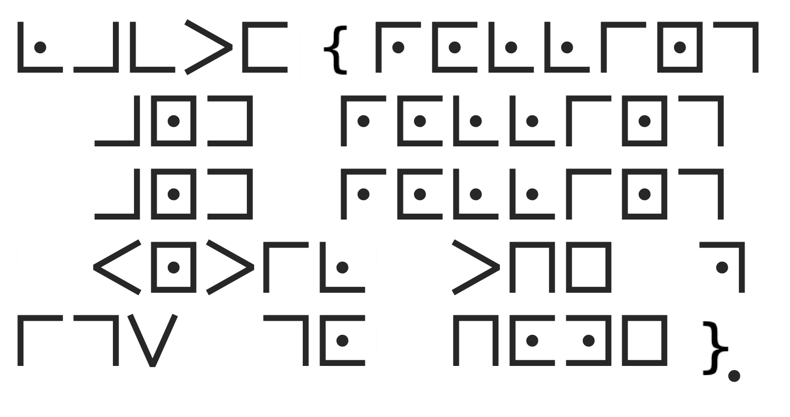

# crypto

Some of the crypto challenges were rather short, so I've opted to include them all here instead of having their own dedicated folders :)

## crypto/one-more-time-pad (486 solves/154 points)

> I heard the onetime pad is perfectly secure so I used it to send an important message to a friend, but now a UCLA competition is asking for the key? I threw that out a long time ago! Can you help me recover it?

We're provided a relatively short Python program:

```python
from itertools import cycle
pt = b"Long ago, the four nations lived together in harmony ..."

key = cycle(b"lactf{??????????????}")

ct = ""

for i in range(len(pt)):
    b = (pt[i] ^ next(key))
    ct += f'{b:02x}'
print("ct =", ct)

#ct = 200e0d13461a055b4e592b0054543902462d1000042b045f1c407f18581b56194c150c13030f0a5110593606111c3e1f5e305e174571431e
```

So the phrase stored in `pt` is encrypted with a one-time pad (hence the challenge name) and printed as a hex string.
Luckily for us, the xoring that occurs when encrypting with a one-time pad is reversible since we know the plaintext, so we can stick the ciphertext and plaintext into [CyberChef](https://gchq.github.io/CyberChef/#recipe=From_Hex('Auto')XOR(%7B'option':'Latin1','string':'Long%20ago,%20the%20four%20nations%20lived%20together%20in%20harmony%20...'%7D,'Standard',false)&input=MjAwZTBkMTM0NjFhMDU1YjRlNTkyYjAwNTQ1NDM5MDI0NjJkMTAwMDA0MmIwNDVmMWM0MDdmMTg1ODFiNTYxOTRjMTUwYzEzMDMwZjBhNTExMDU5MzYwNjExMWMzZTFmNWUzMDVlMTc0NTcxNDMxZQ) to get the flag: `lactf{b4by_h1t_m3_0ne_m0r3_t1m3}`.

## crypto/rolling in the mud (434 solves/179 points)

> uugh, these pigs in my pen are making a complete mess! They're rolling all over the place!
>
> Anyway, can you decode this cipher they gave me, almost throwing it at me while rolling around?
>
> Answer in lowercase with symbols. In the image, { and } are characters that should appear in your flag, and replace spaces with `_`.

We're provided an image for this one:

<div align="center">

</div>

Because I was an avid reader of [The 39 Clues](https://en.wikipedia.org/wiki/The_39_Clues) when I was younger, I immediately recognized this as something encrypted (if that's the right term :)) with the pigpen cipher, which is best explained by a diagram representing how it works:

<div align="center">

</div>

Attempting to decode the image as-is though will lead to gibberish, though.
One thing you might notice is that there's some letters in the bottom right preceding a `}` character, which could potentially match with the `lactf{...}` flag format.
Rotating the image 180 degrees, then, should make more sense, and that is indeed the case:

<div align="center">

</div>

Using the key from above, we can then decipher the flag, replacing characters as we were told to in the challenge description: `lactf{rolling_and_rolling_and_rolling_until_the_pigs_go_home}`.

## crypto/greek cipher (323 solves/254 points)

> You think you've seen all of the "classic" ciphers? Instead of your standard cipher, I've created my own cipher: the monoalphagreek cipher!
>
> Answer with just the flag in lowercase with symbols left in.

Let's check out the file we're provided:

> κςκ ωπν αζπλ ιησι χνοςνθ μσγθσρ λσθ ζπι ιηγ δςρθι ψγρθπζ ςζ ηςθιπρω θνθψγμιγκ πδ νθςζε γζμρωψιςπζ? τγ ζγςιηγρ. κςκ ωπν αζπλ ιησι χνοςνθ μσγθσρ λσθ ψρπξσξοω δονγζι ςζ εργγα? τγ ζγςιηγρ. ς οςαγ ηπλ εργγα μησρσμιγρ οππα ιηπνεη, γυγζ ςδ ς μσζ'ι ργσκ ιηγτ. οσμιδ{ς_ενγθθ_νθςζε_τσζω_εργγα_μησρσμιγρθ_κςκζ'ι_θιπψ_ωπν._λγοο_ψοσωγκ_ς_τνθι_θσω.μπζερσιθ!}

I can't imagine trying to pronounce that :)
Anyways, given that the description refers to this as a monoalphagreek cipher, it's probably safe to assume that it's a monoalphabetic substitution cipher, which means that each greek letter only maps to one normal (?) letter, and vice versa.
This is as opposed to a polyalphabetic substitution cipher, where context can affect substitutions in different ways.

With that in mind, we know that the flag format is `lactf{...}`, and there's a series of letters that looks suspiciously similar to that in the above Greek text.
We can then substitute for those letters to give us the following:

> κςκ ωπν αζπλ tηat χνlςνθ caγθaρ λaθ ζπt tηγ fςρθt ψγρθπζ ςζ ηςθtπρω θνθψγctγκ πf νθςζε γζcρωψtςπζ? τγ ζγςtηγρ. κςκ ωπν αζπλ tηat χνlςνθ caγθaρ λaθ ψρπξaξlω flνγζt ςζ εργγα? τγ ζγςtηγρ. ς lςαγ ηπλ εργγα cηaρactγρ lππα tηπνεη, γυγζ ςf ς caζ't ργaκ tηγτ. lactf{ς_ενγθθ_νθςζε_τaζω_εργγα_cηaρactγρθ_κςκζ't_θtπψ_ωπν._λγll_ψlaωγκ_ς_τνθt_θaω.cπζερatθ!}

That gives us a couple more hints for potential substitutions:

- `tηat` looks similar to "that," so every h is probably substituted for `η`
- `caζ't` can really only be "can't," so we can assume that every n is substituted for `ζ`

My process basically consisted of repeatedly making those substitutions and checking for any other ones that jumped out.
I used a Python program to make the substitution process easier, and this is what it looked like in the end :)

```python
contents = "κςκ ωπν αζπλ tηat χνlςνθ caγθaρ λaθ ζπt tηγ fςρθt ψγρθπζ ςζ ηςθtπρω θνθψγctγκ πf νθςζε γζcρωψtςπζ? τγ ζγςtηγρ. κςκ ωπν αζπλ tηat χνlςνθ caγθaρ λaθ ψρπξaξlω flνγζt ςζ εργγα? τγ ζγςtηγρ. ς lςαγ ηπλ εργγα cηaρactγρ lππα tηπνεη, γυγζ ςf ς caζ't ργaκ tηγτ. lactf{ς_ενγθθ_νθςζε_τaζω_εργγα_cηaρactγρθ_κςκζ't_θtπψ_ωπν._λγll_ψlaωγκ_ς_τνθt_θaω.cπζερatθ!}"

sub = {
    "ο": "l",
    "σ": "a",
    "μ": "c",
    "ι": "t",
    "δ": "f",
    "ζ": "n",
    "ν": "u",
    "γ": "e",
    "ε": "g",
    "ρ": "r",
    "α": "k",
    "τ": "m",
    "κ": "d",
    "θ": "s",
    "χ": "j",
    "λ": "w",
    "π": "o",
    "ψ": "p",
    "ω": "y",
    "ξ": "b",
    "υ": "v",
    "η": "h",
    "ς": "i"
}

substitutions = str.maketrans(sub)
deciphered = contents.translate(substitutions)

print(deciphered)
```

We can then run that script to decipher the entire paragraph, which also gives us our flag:

```shell
$ python decipher-greek.py
did you know that julius caesar was not the first person in history suspected of using encryption? me neither. did you know that julius caesar was probably fluent in greek? me neither. i like how greek character look though, even if i can't read them. lactf{i_guess_using_many_greek_characters_didn't_stop_you._well_played_i_must_say.congrats!}
```