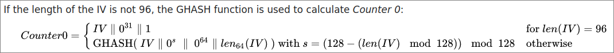

# Galois-t is this? (15 solves / 495 points)

> I'm expecting a super secret message... If you can give it to me, I'll give you a flag!

Provided:
- [`server.py`](provided/server.py)
- [`Dockerfile`](provided/Dockerfile)

Summary: Improper use of AES-GCM IVs allows for generation of authentication tags for arbitrary ciphertexts.

## Solution

It turns out the super secret message isn't actually that secret :)

```python
# line 46 of server.py
message = b'heythisisasupersecretsupersecret'

# lines 122-128 of server.py (in `decrypt()`)
    if(pt == message):
        if(authTag == tag):
            print(FLAG)
        else:
            print("Whoops, that doesn't seem to be authentic!")
    else:
        print("Hmm, that's not the message I was looking for...")
```

The harder part of this challenge will be generating a valid authentication tag, though.
In both the `encrypt` and `decrypt` functions, this `check_nonce` function is called which prevents us from reusing an IV:

```python
def check_nonce(nonce):
    # if you can't reuse the nonce, surely you can't explot this oracle!
    if(nonce in used_nonces):
        print("Sorry, a number used once can't be used twice!")
        exit(0)
    used_nonces.add(nonce)
```

This means that we'll have to generate the tag through unconventional means.

Luckily for us, though, this ends up being possible due to an improper implementation of AES-GCM, specifically in the handling of the nonce/IV itself:

```python
# lines 75-78 of server.py (in `encrypt()`)
    for i in range(numBlocks + 1):
        enc += cipher.encrypt(nonce)
        # the counter is just the nonce, right? right??
        nonce = incr(nonce)
```

The comment kind of gives it away, but the counter isn't just supposed to be the nonce :)

For reference, this is what [Wikipedia](https://en.wikipedia.org/wiki/Galois/Counter_Mode#Mathematical_basis) says about how the first counter block should be initialized:

<div align="center">

</div>

Why is that important?
Well in our case, we're not providing a 96-bit nonce, so the GHASH function should be used to generate the first counter block.
The GHASH function itself depends on the key being used to encrypt with AES-GCM, so we'd have no way to find that first counter block in that case.
Since our nonce is used directly, though, we can exploit some of GCM's properties that otherwise wouldn't be a problem :)

If we send in the bytes `ffff...ffff` hex as an IV, the first counter block will just be that encrypted with the key that we don't know, but it gets more interesting once the IV is incremented.
Because GCM operates on $GF(2^{128})$ (essentially the same as doing everything mod 2^128), incrementing `ffff...ffff` will actually yield `0000...0000`, which is then encrypted as part of the keystream generation process.
As it turns out this `Enc(0000...0000)` block is also used in the GHASH function when generating the authentication tag, so it's not normally something you want to leak :)

Oh yeah, now is probably a good time to mention that AES in GCM mode is a stream cipher instead of a block cipher :)
If you don't know what that means, it essentially boils down to exactly how data is encrypted.
A block cipher encrypts the data directly; one prime example of this is AES in CBC mode.
A stream cipher, on the other hand, normally generates what's called a keystream which is then xored with the data to be encrypted.
This is useful in our case because if we, say, attempt to encrypt a bunch of null bytes, our ciphertext will actually just be the encrypted counter blocks that AES-GCM generates as its keystream.

Providing an IV of `ffff...ffff` like I mentioned earlier will then give us the encrypted counterparts of the blocks `000...000`, `000...001`, and `000...002` (assuming we send in 3 blocks of null bytes to encrypt).
We can then use the encrypted zero block to generate an authentication tag for any ciphertext, and use the blocks ending in 1 and 2 as a keystream to encrypt the super secret message, effectively using an IV of all zeros.

Hopefully that all made sense :)
As always, you can check out my [solve script](galoisnt.py) if you're curious.
A lot of the logic is just ported over from the server script (the GCM-related functions were just copied over verbatim haha), so there's no need to understand how AES-GCM works internally or anything.

Of course the script does give you the actual flag:

```shell
$ python galoisnt.py
Flag: wctf{th13_sup3r_s3cr3t_13nt_v3ry_s3cr3t}
```

Can't help but agree there :)
Maybe next time you should use pycryptodome's implementation of GCM instead of rolling your own if you really want to keep a secret ;)